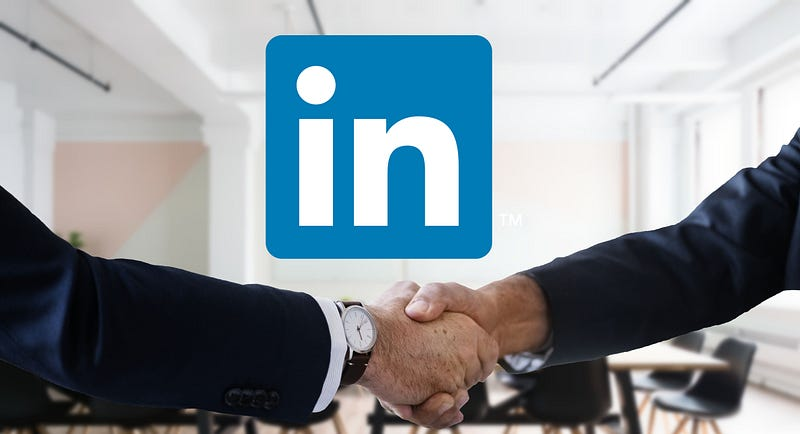

As a Software Engineer, I get several messages per week from recruiters. If I’d responded to all of them, I wouldn’t even have time for an actual job anymore, since the usual persistence of tech recruiters can keep me busy for days on end. Looking back at the ever-growing backlog of hundreds of messages on my LinkedIn, I hereby present “the good, the bad, and the ugly of recruitment on LinkedIn”

### The good

After reading through hundreds of LinkedIn messages, only a very small percentage catch my attention. The ones that do spark my interest usually contain something of the following:

*   They mention why they need me specifically
*   It is a company I know and respect
*   They offer a benefit that is important to me

It’s a big plus if the message I receive is something more than just an automatically generated template with some blanks filled in. For example:

_“I found your GitHub profile in the list of contributors for open source project \[project name\].”_

or:

_“I saw your profile on the Advent of Code leaderboard.”_

These messages spark my interest because they display an exceptional achievement of mine. It shows that the recruiting company looks beyond shallow claims on LinkedIn profiles, which also creates positive expectations for my potential coworkers (assuming everyone was recruited for a similar distinction).

### The bad

Most of the messages I receive on LinkedIn are an immediate turn down for me. These messages contain a sentence that sounds something like this:

_“For a customer in \[place\] I’m looking for a \[role\].”_

I’ve seen peers occasionally respond to such messages, and almost never they ended up in a position that I’d want to be in. Having seen the ridiculous margins of brokers in IT, I don’t want to feed the rising problem of people benefitting from the scarcity of good tech employees. I once had a colleague for whom the company he worked was invoiced 80% more than he earned, with several brokers taking ridiculous fees. Often, responding to messages like these only contributes to the problem.

### The Ugly

When reading a LinkedIn message, I quickly want to be able to figure out why this company is _special_. Among hundreds of messages, I want to be able to make the best choice, so I want to see things in the message that make this company special to me. However, most messages are filled with boilerplate information like:

_“We have an incredibly fun team and the most amazing office.”_

Or:

_“Ready for your next challenge?! We have the coolest projects!”_

To me, information like this sounds very empty and subjective. Based on the limited information they can extract from my LinkedIn profile I doubt they have an accurate idea of what I consider a ‘challenge’. I’d rather have an objective depiction of the company, stating for instance what the size of the company is, how they make money, and what salary they offer.

Especially infuriating are messages that start with something like:

_“I know that you probably get messages like this all the time, but we are not like the others! That is because we \[insert generic story here that applies to every company\].”_

I think here the famous principle “show, don’t tell” applies. Boilerplate sentences like these don’t help to make an informed decision. Better leave them out altogether.

### Conclusion

When I read a LinkedIn message from a recruiter, there are two things I wish to learn:

*   What can they offer me?
*   Why specifically do they need me?

If a company contacts me and they can objectively answer both questions satisfactorily, I usually engage in a conversation to find out more about the company and see if we can help each other out in the future. As for the other 95%, I usually don’t respond at all, since a message like “I’m not interested” usually does not work given the persistence of many recruiters.