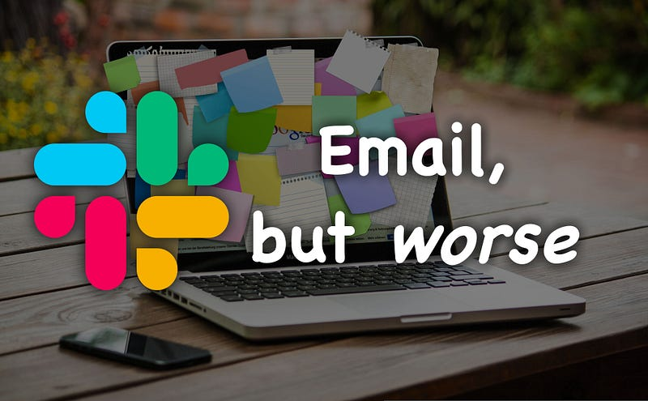

Slack is the new email: it revolutionizes communication in the modern workspace. Instead of overfull inboxes, we now enter the future of communication: drowning in thousands of unread Slack messages in over 20 channels and 6 DMs. What a breeze.

Having worked with Slack for over three years, I grew to despise the tool. There wasn’t a more significant drain on my productivity than this four-colored #-icon. And I’m not alone. Everyone entering the company was overflooded with a barrage of channels and information. Everyone had to find a way to make it work. So, how did we get here?

#### Corporate information flows

In any company, a lot of information needs to be shared. The problem is that some information has to go to multiple people, resulting in long email chains that clog up everyone’s inboxes. Slack’s solution is to create channels for various topics where employees can subscribe and receive information that’s relevant to them.

Sounds great, in theory. But in reality, we’re often only interested in a part of a topic. For example, I was part of a developer channel with around 300 people. Whenever there was an important announcement, like “the MongoDB dev databases will be down for an hour,” everyone in the channel would get notified, regardless of whether they worked with MongoDB. It was an immediate distraction, pulling me away from my work.

Moreover, people are generally terrible at judging which information is relevant to them. It’s like social media: we get bombarded with updates about people we know, most of which we’ll never use. The same goes for following the whole thread about the upgrade to the new MongoDB version, even if it has no impact on our work. This constant stream of irrelevant information is costly and frustrating.

#### The ideal world

Slack has amplified our human tendency for convenience: we want to get our point across quickly and efficiently. But often, messages need to be better structured, and too many people receive information they don’t need. We need a system that allows us to receive only information relevant to our work.

Apart from that, we need to better manage the many channels in Slack. It’s overwhelming to keep up with the sheer number of topics we’re subscribed to and receive information about. Instead, we need a single overview highlighting issues relevant to us.

Thinking about a solution, AI language models could pave the way for more effective communication. These models can digest a massive amount of information and present only the information relevant to our problem. Catching up would be as easy as reading a newspaper.

#### Conclusion

I think Slack is evil. It spreads information everywhere, which creates an immense cognitive load that results in burnout. It’s time to improve and take control of the tools we use. We need a system aware of the generated information and where it’s sent. That way, we can receive only precisely the relevant information in an easily digestible format, and not more.

AI could help us streamline our communication, but it’s still up to us to ensure we’re not drowning in a sea of Slack messages. The real key to success isn’t in the tools we use, but in how we use them — and maybe learning to use the “mute” button more liberally!