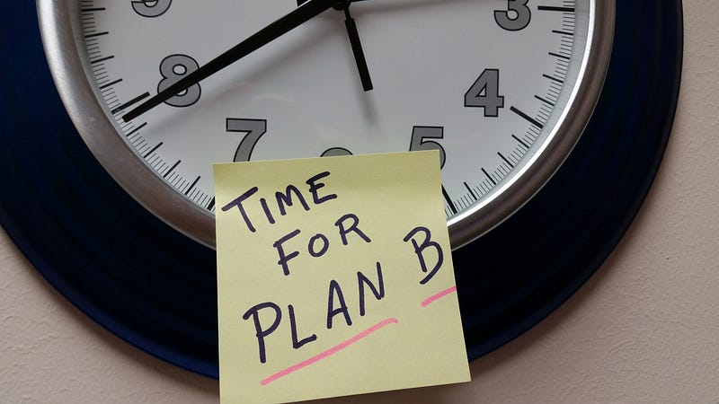

If you’ve ever worked an office job, you probably know that mental health is everywhere. It’s promoted on flyers on the water cooler. Free therapy sessions are offered. Teams leads are being trained to assist team members mentally. Why do we need this?

It’s because we made work impossible. Delivering effective mental work for eight hours per day is psychologically not feasible. And even if you manage to pull it off on a single day, good luck with four more days in the week!

Still, millions of people strive to work such hours productively. Usually, it results in one of two things: burnout or slacking off. Burnout is the most costly, both for the employer and employee, and should be avoided at all costs. So then only slacking off remains.

By “slacking off,” I mean not spending the eight hours productively. We grab a coffee, scroll some Facebook, meditate, go for a walk, stare intensely at the calendar or out the window, etc. And this is what most people end up doing. Many studies show that the number of effective working hours in the average workplace is actually frighteningly low. ([ref](https://socapglobal.com/2019/09/the-average-worker-is-only-productive-for-about-3-hours-a-day/))

And that’s just stupid. Jobs are holding people captive just for a few hours of productivity. And I’ve seen this time after time again in many different companies. The big enemy in this whole setup is the 40-hour work week. Because it makes no freaking sense.

Buckle up and strap in, and let’s destroy the 40-hour work week once and for all.

#### How people work

We all know we can only do focused work for a short time. Deep focus usually doesn’t last much longer than 45 minutes, not counting the ramp-up time. During deep focus, our mind is a productivity machine: we rapidly generate and consume heaps of information. But after the focus time, our mind also needs time to process things. And that usually works best if the mind is unconstrained.

That’s why remote work is so popular. We work for an hour, taking full advantage of our flow state. Then, we shop for groceries, giving our minds the time to frolic around and rest. Later in the day, we utilize another focus period. Then, we do the laundry, again giving our mind time to rest. The problem is that many people still strive for eight hours daily, so they often work deep into the night.

In most offices, we need to be ‘always on’ during office hours. We are expected to respond instantly to messages and do focused work in the remaining time. But for a healthy mind, we must allow it to let go of the focus entirely.

#### Beyond a 40-hour workweek

Currently, I’m my own boss. That means that I can decide my own hours. It completely changed the way I work. Right now, **I base my work schedule entirely on how I feel.**

When I feel inspired, I commit to a certain task on my to-do list. The first fifteen minutes are always hard. Somehow my mind always tends to protest to start working. But then, I get into the flow and fly through the task.

If I complete the task and still feel inspired, I pick the next one and continue. When I feel exhausted, I stop. Sometimes that’s after half an hour, sometimes after two or even three hours.

When I stop, I ban everything digital. Music is fine; listening to podcasts is not. The goal is to let the mind calm back down. Usually, I pick up a simple chore or go for a hike.

It is usually in that off-time when I also get a lot of new inspiration. I always bring a notebook to write down ideas. I feel my brain transition from exhausted to calm.

Usually, I repeat this cycle about three times per day. In total, I make far less than eight hours. And that’s fine. Because every second I do work, I fly.

Some people advocate for timing the cycles by using a cooking timer set for 25 minutes (Pomodoro technique). I don’t think it works. I think Pomodoro is only an extra source of distraction. I can very well feel when I’m getting tired; I don’t need a timer to help with that.

#### Changing the way we work

I don’t think working eight hours unimpeded works for anyone. People burn out or slack off. The solution is to follow our brain: work only when work feels good, except for a 15-minute window to ramp up. After working, we rest till the mind feels at ease again. This way, we maximize productivity and well-being rather than going with the flawed 40-hour workweek.

It is time for companies to acknowledge this and adjust expectations accordingly. Don’t expect anyone to be available all day. Allow people to ‘turn off’ in between work sessions. Let people know you don’t expect eight hours of unimpeded work but rather around four hours of focused sessions scattered throughout the day.

Everyone’s cycle is different, but nobody’s cycle features eight unimpeded hours. In brain-heavy jobs, we must eliminate the 40-hour workweek and the expectations that come with it.

What do you think? Can we make the change? Or will we forever be glued to our desks, absent-mindedly doodling circles in a notebook?