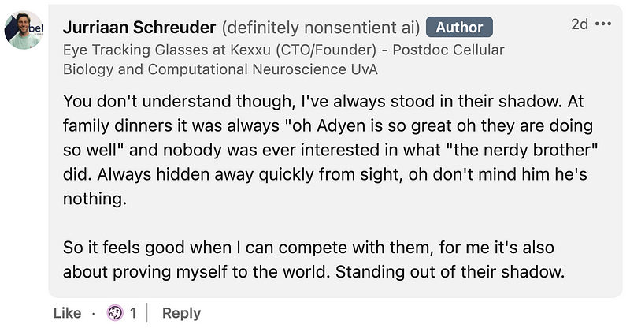

The other day I was scrolling through LinkedIn, a bad habit of mine, when I saw a message from the brother of the girlfriend of Adyen’s founder:

There’s obviously a bit of context, but I don’t think it’s important to understand the message. Jurriaan wants to prove himself. When I read the message, a few thoughts crossed my mind. I was drafting a message to respond but decided I didn’t want to say anything that could be perceived as a personal attack. So I decided to write a blog post instead, where I have more space to give context.

Looking at Jurriaan’s profile, I imagine him as ambitious: he has a PhD, is founding a company, and has impressive experience. His message shows him feeling competitive toward his sister’s boyfriend. Competition is good. Using it as motivation is good. But being weighed down by what other people say about you is not.

I recognize this behavior, both in myself and others. We want to be on top. We want to reap the social rewards that come from success. For myself, I have learned that it made me a worse human being. In my mind, I grew spiteful toward more successful people. I damaged myself in my relentless pursuits for success.

In the past, I made software that was downloaded by millions of people. I’ve always compared myself to my past self, chasing higher successes. Not to go down as merely a child prodigy. Back then, it was not success that motivated me. I just enjoyed making the software, regardless of whether a single person would download it. But having tasted success, it poisoned my mind to chase after similar social validation.

When reading Jurriaan’s message, I felt a similar vibe. Instead of his past self, it’s the successes of a family member that he compares himself to. To be the one mentioned during the family dinner. And I think that’s a bad measure of success. It’s similar to the situation of Dave Mustaine, the creator of the successful band Megadeth (25 million albums sold), who was unhappy because he wasn’t as successful as Metallica (180 million albums sold). (see [https://markmanson.net/measure-your-life](https://markmanson.net/measure-your-life) for context)

All this I wanted to summarize in a message to Jurriaan. But I didn’t. Because, well, what do I know? I’m just another internet user looking for a fight because I think I know better. And nobody has ever risen from such a fight and changed their mind.

But I do write about it to get it off my mind. To silence the voices in myself that mirror Jurriaan’s thoughts. The voices that scream for social validation. But I will not let them. Because ultimately, whatever people do or do not say about me, it’s my happiness that is at stake.