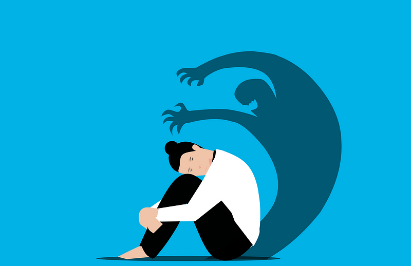

This is it. The moment I lost it. If you’ve followed me, you might’ve noticed it before. A few subtle signs of insanity. Words in my writings that felt out of place. Well, I’ve reached the point of no return. Nothing I say will make sense from here on out.

**Everything is made up.**

Close this article while you still can. Remember me as the person I was. Heck, maybe even break every line of communication with me. It’s for the better, I swear. At this point, I won’t make any sense anymore. Because none of it is real. You, whoever might still be reading, are not real. These words, which seem to have at least some sense of coherency, mean nothing more than anything else out there.

_Who are you?_

If you had asked me that half a year ago, I might’ve said that I’m a software developer. If you dove deeper into my personality, I might’ve stated that I’m creative and adventurous. But all those attributes are just illusions. I’ve always been delusional. Till now. Right now, I see everything so clearly.

The illusion of being a software developer came from an imagined skill of my made-up self. A skill to think in abstractions. To ask for any concept, “what logical concept lies an abstraction level above this?”. And it worked. Suddenly, a whole lot of things in life became a breeze. I thought I understood everything. I imagined myself as a flawless human being. But I was wrong.

Something had always been tormenting my mind. Occasionally, I would scream at my brain to just figure things out, for it to understand how everything ties together. To see what the big answer to my existence is. Will riches solve all my problems? Or is life all about doing what feels good? Is it about chasing meaningful things? Or should I just follow my intuition?

There is one question underlying it all:

_What is the highest abstraction level?_

From each logical concept, we can go up. From cow, we go to animal. From animal, we go to organism. From organism, we go to matter. You get the drift. But what is all the way up there? What is the concept that encompasses all?

**The answer is that everything is made up.**

Shocking. I know. And if you hoped for a concrete explanation of the answer, I’d have to disappoint you. I’ve gone crazy. I’m beyond any concrete explanations. But I will try to write down some words, and maybe you’ll figure it out. Maybe you won’t. Maybe these words will never reach a single reader, which is also fine.

The key to understanding the highest abstraction is to consider our collective understanding.

_I am a software developer._

_You are smart._

We use these statements to describe our perception of the world or how we imagine someone else’s world to be. But in reality, we have no idea. We’re flawed thinkers with an incomplete understanding of ourselves, let alone others.

Attributing myself as a “software developer” is a made-up story based on how I present myself. Attributing you as “smart” is a made-up story based on how you appear to me. I might reject your taste in music based on my made-up beliefs about good music. But what do I know? Nothing is real.

This story is mainly about approaching others with a lack of judgment and approaching ourselves with skepticism. I think a lot of interpersonal conflict stems from taking ourselves too seriously and applying our worldview to others. If we could all see the reality that everything is quite arbitrary, we may just approach others respectfully, no matter how different their worldview is from ours.

So at this point, I won’t identify myself as anything. I’m not a software developer. I’m not creative or adventurous. I just am, and that’s all I can say (thanks Descartes ❤). The rest, it’s all imaginary.

> “What software engineering and philosophy have in common is that they are both about finding abstractions in complex systems.”

This was a scary one for me to post. I have a professional reputation that I don’t want to ruin with my philosophical thinking. But I think that philosophy is part of us all. And it’s important to embrace it now and then.

The format of this article is my attempt at doing something creative. It is intentionally **vague**. And there’s a reason behind that: it makes you think. If I’d just made my point, you’d move on to the next item in your life. But now, the words I write down gnaw at your subconscious, trying to find an internal narrative in which the words make any sense. At least, that’s the goal.

Outward, I tend to construct a perfect version of myself. And this article is about deconstructing exactly that. I want to be my quirky self, not this heavily self-regulated professional machine I’ve become. And that includes exposing part of my quirky self to the outside world.

Now, I’ve confessed that all of it doesn’t matter. It’s all made up. This perfect “outward image” of myself is made up. My reputation is made up. So I will be more gentle with myself and let go of the constant need for social validation. Because that, too, is made up.