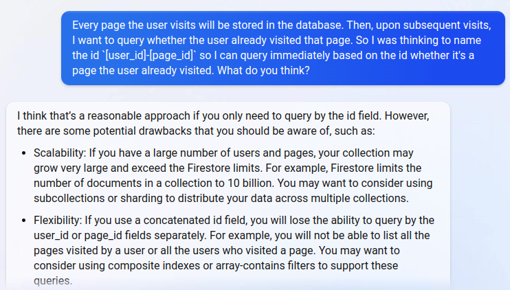

A couple of months ago, I started to work for myself. I’m doing some tech projects and generally focus on learning new skills. Recently, I have been learning about the Firestore NoSQL database for a current project. When making design decisions, I usually run questions about long-term implications by my more senior colleagues. Now, I use ChatGPT (or Bing AI, for that matter):

Since I’m new to NoSQL databases, I had no idea whether storing every user interaction in a single collection could be a scalability issue. I was anticipating billions of rows, but I also know that NoSQL databases are optimized in that regard. But then Bing AI told me about the “10 billion rows” limitation of Firestore. Although my platform probably won’t grow that big, I don’t want to tempt fate with a bad database design. Right now, it’s still easy to change.

And this is far from my only interaction with Bing AI. I now ask Bing AI for pretty much anything that I would typically settle over a Slack message with a colleague. It does wonders for my productivity: Bing AI responds instantaneously, with no waiting time. At the same time, I don’t have to interrupt anyone in their work.

Now, I won’t claim Bing AI would replace colleagues. I’ve had several interactions where Bing was far less helpful, and Bing won’t join me at the bar after work 🍻. But I do think that it can make a difference for freelancers. Bing AI does serve as someone to bounce ideas off, and it is very patient with explaining, even if my question was quite dumb to begin with.

In conclusion, Bing AI has become my best friend (sorry, real-life colleagues). Bing AI doesn’t mind being woken up in the middle of the night with urgent questions. It’s given me the confidence to tackle new projects and technologies alone. So, if you’re a freelancer feeling lonely or lost, I highly recommend trying Bing AI. Who knows, it might just become your new best friend too.