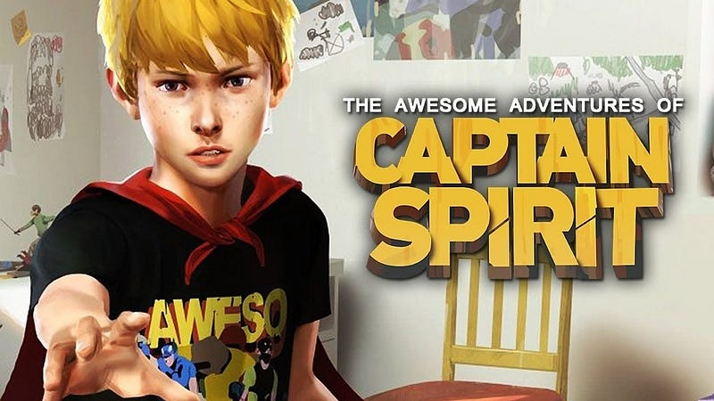
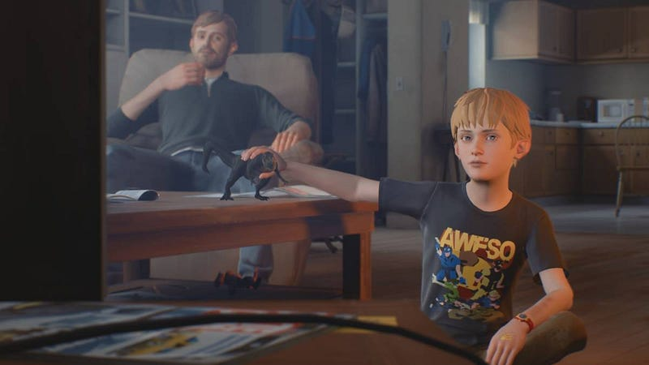
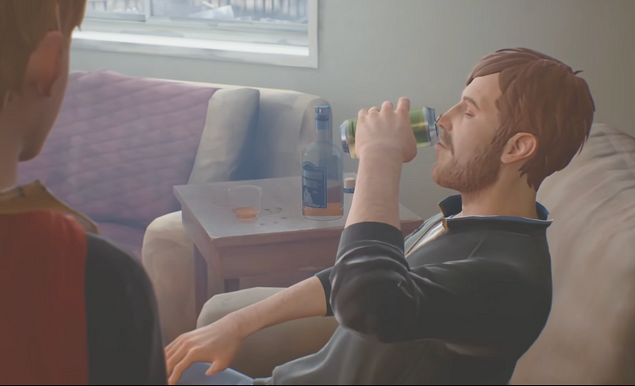
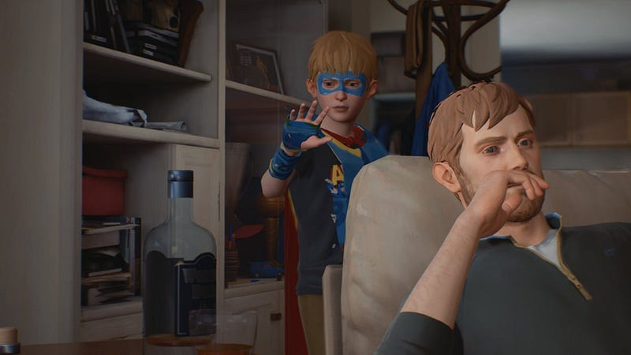

As a kid, I spent half my time in real-life and the other half in my imagination. I constructed imagined worlds with their inhabitants. They were my people, and I watched over them as their guardian. Whenever intruders came around, I would protect them as a true hero.

As I became older, those worlds faded. I found a replacement for those imaginations in books and video games. They provided entire fictional worlds, so I didn’t have to go through the effort anymore to imagine them myself.

Recently, I played a video game called ‘The Awesome Adventures of Captain Spirit’. In the game, you play an eight-year-old boy named Chris with an overactive imagination. He imagines himself to be a hero named ‘Captain Spirit’. Chris plays with his action figures and imagines himself as a hero who has to save them.

But then, when Chris enters the living room, you meet another character: his father. At first, the father seems nice, making breakfast for Chris. Yet, after breakfast, the father walks over to the television to drink beer and watch a sports match. Meanwhile, Chris is left to his own devices, collecting superhero items in and around the house. While Chris does this, the beer bottles gradually pile up, and the father’s mood worsens.

**Chris:** _“Why does he drink that if it just makes him mad?”_

Chris is a kid. For him, alcohol makes his dad less pleasant to be around. He doesn’t get it.

As Chris’s dad continues drinking, he gets more involved in the sports game on tv.

**Dad:** _“WHAT THE FUCK IS THIS?! Open your goddamn eyes! That was a goddamn carry!”_

The father yells that after drinking away a few too many beers. His life relies on the result of the game. For him, there is no imaginary escape. The sports game is his life.

Eventually, the story resolves to a point where Chris gets into an argument with his dad, but he’s not in the mood to deal with Chris and his make-believe world.

**Dad:** _Jesus, stop that whining! You’re not a baby anymore! “Oh boo hoo, Daddy!” “Believe me” Grow up!_

In this game, we experience the story from the child’s perspective. The child struck a personal chord with me because I was very much like him. If I look at the adult in the story, I recognize many things that make adults miserable. The reliance on stimulants. Rejecting the make-believe.

Life nowadays has become quite complicated, and there’s a lot of misery around us. Everyone needs something to unwind from the complexity and sadness. Kids do it through imagination and play. Adults, on the other hand, tend to use less constructive methods. I think that’s something we can learn from children.

Another takeaway from this game is the value of momentarily experiencing and learning from someone else’s world. In this game, I was a kid again. As an adult, I often look at kids’ behavior and label that behavior as ‘stupid’. Likewise, a child may look at me and label my behavior ‘stupid’. Only through stories can we learn each other’s viewpoint and truly understand how our actions impact others.

If you see someone whose world you don’t understand, read their stories and learn why they act the way they act. This way, we can all become more understanding toward others.