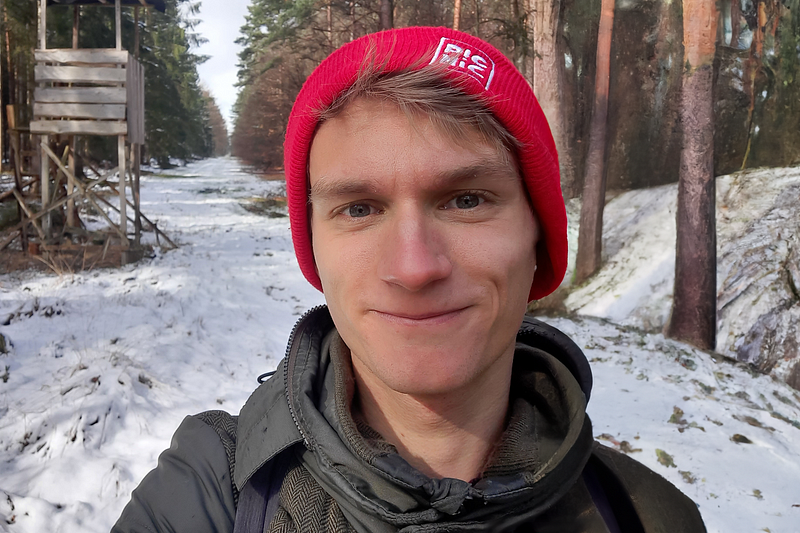
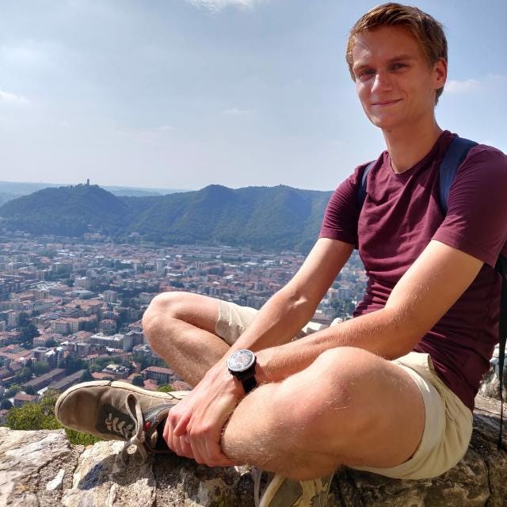

Hi there! If you’ve been following my Medium for the short and snappy tech stuff I tend to post, please skip this one — no hard feelings. This one’s more personal. This is the first blog post where I discuss my life instead of the usual abstract topics.

Before I start, a little content warning. In this post, I discuss personal things about myself. It includes topics like depression, death, etc. Don’t read this blog post if you’re sensitive to those topics. This blog post does not aim to give any advice. It just gives an insight into me as a person.

Let’s go!

#### Why I’m writing this post

Why is it that we keep secrets? Why is privacy so important to us? There are obvious reasons: some things are irrelevant for anyone to know. Other things we might be ashamed of or seem inappropriate. Sometimes, I feel we’re making things too complicated for ourselves by curating exactly what specific people should or should not know about us.

That’s why I want to expose myself more. Writing is a way for me to get thoughts off my mind. Sharing those thoughts serves as a way to be open about how I feel. I think that by understanding each other better, we can grow closer to each other. So via this article and this blog, I let you peek deeper into who I am.

It feels weird to share this with the entire world. But not everyone will read this. I’m only exposing myself to those sufficiently interested in me to read my story. And those people are exactly the people I want to read it :)

#### My trusty sidekick

Before I tell my story, I want to introduce my trusty sidekick: my diary. I started writing in my diary when I started experiencing mental health problems. Whenever I figured something out about myself or the world around me, I wrote it into my diary.

> **My Diary, Saturday, April 9, 2022 at 12:25 PM**

> My diary is a murder investigation log. The suspect is my own mind. The murdered entity is my soul. I’ve discussed several leads, but I remain at a loss as to who is the killer.

Without further ado, let’s kick off my story from my childhood!

#### The Simon that is lost to time

The guy in the back, that’s me. In the front is my older brother, Remco, who died at fifteen due to cancer. My brother and I were close. So close that we would spend many nights together and that I used him as a role model for pretty much anything.

The past me was very imaginative. My parents regularly described me as someone “living in his imagined world” and I could be slow on the uptake because I’d have to switch back from whatever I was daydreaming about. Life was safe. I had a close family and a stable home situation. I did well at school, had many friends, and had few worries.

#### Post-trauma Simon

Trauma does weird things to people. It both strengthens and weakens people in unpredictable ways. It’s often hard to see what kinds of things are attributed to the trauma and what’s a natural evolution through life stages.

I was thirteen when my brother died. Before that, reality and fiction were intertwined for me. I used the same playful approach to life as I would to my imagination. After I lost my brother, that changed. In the real world, I became cold and rational. I also spent significant time avoiding reality altogether: reading books, playing video games, computer programming, etc.

> **My Diary, Sunday, June 19, 2022 at 11:30 PM:**

> There’s a reason why I shut down my emotional side. It’s because if I really confront my emotions, I plunge into despair. That’s because the world is inherently unfair.

> Remco didn’t deserve to die. A world that works in such a way is a shitty system. I refuse to be a part of that system. I refuse to accept such unfairness. But the whole point is that it’s something I have no control over. So either I live in eternal anger, or I shut down my emotions completely. It’s only the latter that actually allows me to continue on living.

Shutting down my emotions allowed me to be brutally effective. Over the course of five years, it gradually turned me into a productivity machine: every minute had to be well-spent. I had some high-over goals, like my career, sports, learning, and making creative things. I excelled at each of them.

I optimized my habits. The first major result of that was an outstanding academic performance. I got my first full-time job right around the time that the Covid pandemic started. For a large part of the lockdown, I was doing the following ritual:

*   Running 75km and cycling 150km every week
*   Working a full-time job in Software Engineering, doing loads of overtime
*   Working a part-time job (12 hours) in teaching, doing loads of overtime
*   Writing a fiction book, among other personal projects
*   Catching 9 hours of sleep every night to keep on going

And all of this was great. I felt super energized, and everything went super smoothly. I hit physical records and made amazing academic and professional achievements, which gave me confidence. I felt like a superhuman… till I didn’t.

> **My Diary, Wednesday, April 6, 2022 at 10:05 PM**

> There’s a constant confidence struggle for me. A lot of the time my internal narrative says I’m better than everyone else. Where people around me are flawed, I’m a flawless instrument of progression. But then there’s another internal narrative that tells me I’m too occupied with feeling good about past achievements, that actually I don’t amount to anything. My social skills are worthless. My personal projects all fail. My learning progress is stagnating. My mental state worsens, causing all kinds of issues down the line.

You probably see where this is going, especially with my content warning. But no, I’ve never been diagnosed with depression. My crazy schedule and constant stress didn’t even make me burn out — I hardly used a single sick leave. But still, something was getting screwed up in my brain.

> **My Diary, Friday, April 8, 2022 at 9:34 AM**

> Having a burn-out means that the mind’s scream for changing circumstantial factors is finally overwhelming enough to force you to change your circumstantial factors. Taking some time off is really a proxy for taking a step back and reconsidering life. Unfortunately, our primal goals do not always align with our own goals. Further numbing ourselves is not the goal, but it is often what we end up doing.

> And that’s precisely where I’m stuck. My mind is screaming for a change of circumstantial factors, yet I don’t allow my mind to seize control.

Being in this near-burnout, near-depression state, I learned some things. Burnout is a state we enter when our cognitive load exceeds our maximum. Depression is a state we enter when our discomfort and comfort are out of balance, without the means to change it. But for both, the thresholds are not static: they change with experience. We can learn to be more resilient.

My crazy schedule created a lot of discomfort for me. I was holding on to the schedule like a bible. Sometimes I would sleep poorly but still force myself to run 25km.

> **My Diary, Tuesday, November 8, 2022 at 10:46 PM**

> Sometimes, I feel god-like. At other times, it all comes crashing down, and I’d wish I could blink out of existence.

The above diary entry describes the “manic” nature of my situation pretty well. Most of the above sounds pretty bleak, but most of the time, I was doing great. I’d feel invincible. But then, inevitably, I’d fall deep. I’ve learned that there’s a cyclic nature to this: that high-dopamine periods will inevitably lead to low-dopamine periods. But I didn’t yet give up. The periods I felt low were yet another problem to be solved.

#### The path to enlightenment

As a self-improvement-driven guy, I tried to find solutions for how I was feeling. I was reading a lot of literature about meditation, dealing with stress, and living a happier life. However I tried, I kept hitting rough spots.

> **My Diary, Monday, July 4, 2022 at 6:55 PM**

> **Me on Sunday:** Oh boi, I’m dreading my workweek, dealing with hundreds of requests on a daily basis.

> **My spiritual self:** Setting negative expectations is forbidden.

> **Me Monday morning:** I slept like shit this sure is gonna be a terrible day.

> **My spiritual self:** Mind your expectations my boi.

> **Me Monday evening:** Running 17k while exhausted sure is fun.

I knew how easy it is to drag yourself down by setting negative expectations. I knew that once I accepted that I was burnt out or depressed, it would soon become a self-fulfilling prophecy. But even with all that knowledge, my state of mind didn’t improve.

> **My Diary, Tuesday, July 5, 2022 at 10:27 PM**

> When my state of mind changes to “sad”, my sphere of influence changes as well. I’m more prone to seek out the voice of others who deal with similar issues. There is a duality in such acts. On the one hand, it may amplify my sadness, because mood is contagious. On the other hand, I may learn from their experiences, to better deal with the situation of my own.

#### Quitting my job

Having failed the path of self-improvement, there was only one solution: overthrowing an assumption I had held for way too long. It all started with the following diary entry, which is my way of making sense of my mind.

> **My Diary, Friday, September 16, 2022 at 9:43 AM**

> “Working for Google is a decision I could never regret. Even if my time there is awful, I’ll have Google on my CV.”

> This is flawed thinking. First of all, time is the most precious resource. Wasting time is never worth it. Also, seeing “having Google on my CV” as an exclusively good thing is also flawed thinking. It may push me towards higher-paying jobs, but that doesn’t necessarily make me happier. Decisions taken cannot be undone, and their repercussions echo throughout the entirety of life.

When I finished university, I saw “working for Google” as the perfect way to kickstart my career. It would skyrocket me up the corporate ladder. I had never questioned whether this would be a good decision. But when I did, it entangled many other assumptions that didn’t align with my true motivations.

> **My Diary, Friday, September 16, 2022 at 9:50 AM**

> Even though I’ve been saying I don’t care about money, money has always been my definition of success.

> I have been optimizing my life toward earning the most money. Chasing stupid success to become filthy rich. My whole corporate progression has been to earn more, get up higher the ladder, and earn even more. I’m afraid to quit because I’m afraid I’ll never earn as much again and destroy my professional progress. “Reaching my potential” has been defined as “earning money”.

> Fuck myself. Money has ruined many lives and will ruin mine. I really must get rid of this flawed way of thinking. Chase happiness and meaning rather than money.

Less than two weeks later, I handed in my notice. I still had three more months of work to go. After that… I didn’t know. I knew that I didn’t want to work for a boss in the foreseeable future. I knew that I wanted to see more of the world. And I knew that I had a couple of personal projects I wanted to finish. With those goals in mind, I started planning how to pursue my dreams.

#### A dream come true

I planned a trip through Europe: one AirBnB per month within driving distance of each other. Below is the map of all the places I booked.

I started in the north in February and plan to travel to Rome in over eight months. I selected locations where I could work and enjoy nature. My first destination, which I visited last month, was Sweden. I traveled there by ferry.

I was off to a slightly bad start since I became sick for the first week, but my time after that was a total transformation. I used the Meetup app to meet people with different interests: meditation, yoga, tech, workout, games, etc. Meeting all kinds of different people was the key for me to improve my mental state. I finally had people to talk to about the mess in my head. I met someone special during a meetup with whom I could share my deeper struggles, which did wonders for me.

My time in Sweden improved my mental health, which I noticed in several ways: I slept well, was happy most of the time, didn’t feel super low anymore, and had greater self-control.

> **My Diary, Tuesday, February 21, 2023 at 11:29 AM**

> Life changes that feel significant at the moment are not always life-changing on a personal level. Retrospectively looking back at my working life, I feel like I’ve taken a very safe route, that may not always have led to the most meaningful outcome. I’m not sure if my current ventures lead to more meaningful outcomes, but at least I can experiment with personal change in a completely different domain.

> I guess that’s what life is all about. Experimentation. It’s probably a lifelong process, and we never feel fully satisfied. But that’s what growth is all about.

Next up, I traveled to a farm in Germany. The farm is 50km from Hamburg located in a small uneventful town. After not working on much during my time in Sweden, I imagined I could spend my time on the farm to finish the fiction book I’d been working on for three years. The farm has a wooden stove, creating the perfect writing atmosphere.

The situation wasn’t all that perfect, though. Except for the wooden stove, there wasn’t another way to heat the house. I only lit the stove in the evening, so during the day, I was usually working in freezing cold. It learned me something about balancing comfort and discomfort. My baseline discomfort grew with the cold temperatures, and my daily behaviors (working, mostly) failed to offset the discomfort with comfort. My mental health dropped, losing many of the before-mentioned benefits that I had in Sweden.

But, unlike last year, I have the space to manage the discomfort. Because I now have the most precious resource in abundance: freedom. So whatever comes at me, I have the freedom to change it. And that makes a huge difference to me.

#### Conclusion

I didn’t write this to score pity points. My life is good and I’m very fortunate. But I have a story, like everyone else. And this is my attempt at telling that story.

I have recorded many of my feelings and thoughts in my diary. It helps me reflect and avoid the same mistakes in the future. I hope that it was interesting in some way.

Take care! ❤