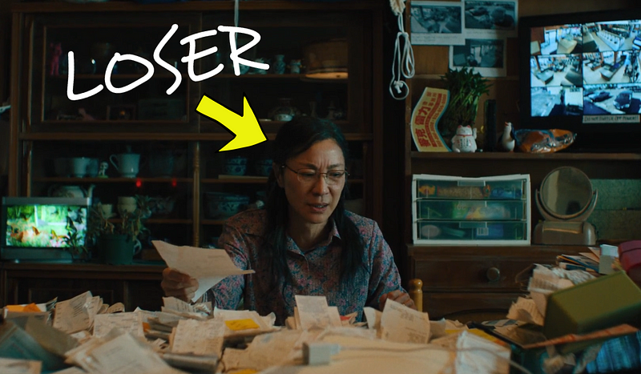

Let’s talk about Everything, Everywhere, All at Once—the movie, I mean. If you haven’t watched it, it’s a movie about a woman who can’t pick what she wants to do. So she does everything. But in the process, she is mediocre at everything she does. It causes her a lot of stress, and she fails time after time again. She is a loser with a winner’s mentality.

I’m like her. If you ask me at any point in time what I’m working on, there’s never a single answer. I have a couple of tech projects, I write, I make music, I want to be a YouTuber, and I have some artistic pursuits every now and then. I’ve always been ambitious and worked hard. Yet I fail at everything I do. I’m a loser with a winner’s mentality.

#### The ten thousand-hour rule

> “Anyone can become good at anything if they practice it for ten thousand hours.”

I could be a master piano player if only I had spent ten thousand hours practicing. As much as I’d love to be the coolest guy at the party, I know I won’t enjoy practicing the piano for so many hours. In fact, I don’t think there’s anything I’d like to do for so many hours. So I’ll never beat mediocrity (or slightly above average at best).

I sit in my room, munching popcorn as I brainlessly watch another “people are awesome” compilation on YouTube, which shows some people's amazing talent. I used to feel envious. But now, I don’t. Because behind each impressive feat, I imagine a sacrifice of ten thousand hours. And I’m not willing to sacrifice that for a 5-second clip in a YouTube video.

#### Losers unite

In society, we often see a negative feedback loop around losing, as if it’s something to be avoided. That achieving success should be a man’s biggest desire.

I don’t think so.

Every loss has its lessons. Short-term, it sucks. But in the longer term, it makes us stronger. With winning, it’s quite the opposite. Short term, it’s great. But in the longer term, it almost always screws us over because we’ll strive after even higher successes.

We should celebrate, but not glorify, losses.

I spent hundreds of hours writing a shitty book that will probably never hit the shelves. And that sucks. Now, I’m demotivated ever to write anything significant again. Also sucks. But I’ve learned a ton doing it, and now in hindsight see many things that make the book bad. And that’s great.

#### Conclusion

I don’t think I’m alone in having many interests and never being able to stick to anything. It’s part of why the Everything, Everywhere, All at Once (gosh, what a long name) movie is so popular. Many of those people may feel insignificant, like they will never achieve anything meaningful. And like the movie's plot went to show, that’s perfectly fine.

There’s no need to be a movie star. No need to be the guitar player that wins all the girl’s hearts. As long as you’re chasing your passions, even if they change every day, you’re learning. So don’t strive to be a winner. Strive to be a good loser ;)