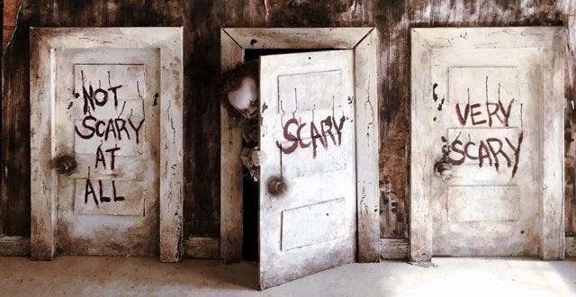

You’re running through a haunted house, away from an evil creature. You reach a room with three connecting doors: ‘Not scary at all,’ ‘Scary,’ and ‘Very scary.’ Exciting! The designers of this house thought about everyone. The novelty seekers can opt for the scarier options, whereas the more conservative people can opt for the boring door.

But, some doors are better left unopened. Because once a door is open, it may be difficult, if not impossible, to close it again.

#### Let’s try some heroin 💉

Now, let’s categorize some stuff in life. What kind of things would be behind the “not scary at all” door? For me, it would be playing games and hiking. What about the “scary” door? For me, behind it is improv and public singing. Now, what about the “very scary” door? Behind that one, for me, is heroin.

Through other people’s stories, I can experience what is behind the door without going in myself. Let me share [a little AMA (Ask Me Anything) post from Reddit](https://www.reddit.com/r/IAmA/comments/9ke63/i_did_heroin_yesterday_i_am_not_a_drug_user_and/) of a fellow thrill seeker who tried heroin (edited/shortened for readability):

> I have never been a drug user, I drink once in a while and smoked pot years ago back when I was a teen in high school a few times and that’s it. **I’m 24 now, have a master's, and a well paying full-time job**.

> **My life has been pretty boring the last few years and I feel like I haven’t really lived**, taken any risks, or done anything crazy so I figured what the hell maybe I’ll buy some pot, it’s been a while.

> The dealer I met in a park couldn’t sell a small amount of pot, but he did have Heroin. I’ve heard so much about it and how crazy addictive it is and it really started to intrigue me. I’ve always wondered what it would be like to do Heroin. Out of nowhere, I say I’ll take it, and we do the deal there.

> Using it, I had the most pleasurable feeling of pure relaxation and bliss wash over me. I just sat there and everything felt amazing. It was like a full-body orgasm times ten that kept going on and on. I must have been high for ten hours straight.

> Heroin is pure powdered pleasure, **I actually feel proud of myself for having the balls to do something this crazy** and I feel like it was a valuable life experience and my window into another world and part of society. I will never forget the day I did heroin. Now, ask me anything.

The parts that are marked in bold are those that resonate personally with me. As part of my open personality, I try to have as many experiences as possible and expand my worldview through them. Heroin, and stimulants in general, are something that I don’t dare to do, which limits my understanding of the world.

Now, the story of this Reddit user doesn’t end here. The responses to his post about trying heroin already foreshadowed what was about to come. For instance, take [this comment](https://www.reddit.com/r/IAmA/comments/9ke63/comment/c0d5dcf/?utm_source=share&utm_medium=web2x&context=3) on the original post about trying heroin:

> Your story sounds very similar to the way I first tried cocaine. As a creative professional in the TV business, I was a successful career guy and had never really used drugs. I tried it one night on a whim when a friend had some and had a similarly incredible first-time experience. I had the same thoughts of “Wow, I see why people love this and get hooked. I won’t do it anymore though.”

> Within a year, I had become seriously addicted, depleted my savings account, run up several credit cards to the max, run from the cops while I was high, done a month in jail for evading arrest, had to move in with my parents, and lost my job and my career.

> The difficulty with addiction and drugs is that THAT’s how it starts, just as you described. Innocent. Amazingly pleasurable. No consequences. If there is anything I can GUARANTEE you, especially with “hard” drugs, it’s that your tolerance can build quickly, and it won’t be long until you are using more, and using compulsively to feel normal… to escape the pain of everyday life.

It is intriguing to me how destructive these drugs can be. Drugs are, in essence, just chemicals that stimulate certain parts of our brains. But apparently, messing with our brain's “reward systems” can come at a cost. These systems reward good behavior and make us do more of it. Unfortunately, it cannot distinguish between actual good behaviors and these drugs.

Let’s go back to the original story. After his original post, two weeks went by. And then, after two weeks, he came back with [the following post](https://www.reddit.com/r/IAmA/comments/9ohdc/2_weeks_ago_i_tried_heroin_once_for_fun_and_made/) (edited for readability):

> I know there will be a lot of people telling me ‘I told you so’ and urging me to seek help, and they are right. I have been using heroin for 2–3 day periods, then taking a couple of days off then using again. I have injected 5 bags since 4 pm, the last one a little less than an hour ago, and am tempted to do one more.

> Fuck my life. I wish I was trolling and this was all some elaborate lie. I was doing everything right, have been clean, and somehow a rumor got out that I've been using. My girlfriend found out and she broke up with me last night. I have some serious unrelated business/work I need to attend to in two hours and I don’t know if I’ll be in any state to be able to and be ready. I can’t stop crying. Fuck heroin. Fuck my life. I guess I don’t need to say that since heroin pretty much fucked my life for me in under two weeks, I just want to die.

> I'm still withdrawing, throwing up, and sweating out gallons of sweat. I really want to use and relapse right now, I know I shouldn’t. These urges are so strong and overpowering. Please help me if you can before I get the chance.

So, to summarize: a successful guy decided to do something brave. In the process, he opened a door he couldn’t close afterward. In just two weeks, he got completely addicted to heroin and he destroyed his life. He’s even considering suicide. I could relate somewhat to this guy’s motivation in the first message. The second message projected a messed-up future had I gone the same way.

There was [one comment on the second post](https://www.reddit.com/r/IAmA/comments/9ohdc/comment/c0dnc04/?utm_source=share&utm_medium=web2x&context=3) that deeply resonated with me:

> If I may be philosophical for a moment…

> Life is all about novelty. It’s the novelty of our experiences that make life worth living. You’ll remember your whole life who your first crush was, how exciting it was to drive a car the first time, or getting drunk, or getting lucky with that beautiful girl.

> But the novelty of any experience will wear out after it’s been repeated too much. I wish driving my car each day to work could be as exciting as the first time I got behind the wheel, but it’s not. The toys from when I was a kid can’t keep my attention any more. The songs I have on my iPod have played themselves too many times.

> But, and listen, because this is important, there are other songs out there I can load on my iPod; ones I haven’t heard before. There’s a girl at a house party that can tell you a joke you’ve never heard before, and make you feel something different. You can get her number and take her to a movie the two of you have never seen and you’ll enjoy it a lot.

> Heroin will be the greatest thing you’ll ever experience. That’s a striking blow to novelty. Like that old toy in the corner, getting laid doesn’t get your attention any more. Who gives a fuck what band is popular this week? They’re all the same. So are all those god damn movies they show at the theater. What’s the point? And that beautiful girl? There’s nothing in it for you. But there’s a lot in it in shooting up heroin. Man that feels great doesn’t it? But those come downs sure suck don’t they? As your tolerance for heroin goes up, your tolerance for loneliness goes down.

> You’re fucked. Sorry to say it. I’m merely using this comment and exploiting your story to tell other people what’s worth living for. Will you be able to get off heroin? Possibly. But will life have any novelty left after you do? I wouldn’t bet on it. You’ve played your own song too many times.

This comment taught me a lot about life and how striving for more usually ends with having less. In life, we have to make sacrifices to experience good things. That is because when we experience something uncomfortable, our baseline dopamine level rises, and mundane things seem more pleasurable. It’s why many people report that during or after a run, a lot of otherwise mundane things suddenly elicit a lot of joy. Likewise, when we experience something intensely pleasurable, our baseline dopamine drops and life suddenly seems bleaker than it would seem otherwise.

Every form of addiction (food, social media, porn, etc.) comes down to behavior that drops the dopamine baseline. Our brains have not evolved to properly deal with these modern abundances. Many years back, getting tasty food required a sacrifice of hunting and preparing. Nowadays, we can get such things with virtually no effort. And that’s problematic.

#### What about the non-extremes?

Heroin, of course, is a very extreme example. Let’s take a giant leap back. Away with the syringes, let’s pour ourselves a nice pint of beer. It makes us more easy-going and makes parties more fun. And the best thing: we’re not dependent on it. Most light/moderate drinkers could easily quit drinking if needed.

So, is it a door worth opening?

The problem is, once we start drinking, we have opened the door. We know there’s something that can make us happy when we’re sad. For most people with balanced lifestyles, that never becomes a problem. But for some, it does.

Seasons change, shit happens. We lose our girlfriend. We become the victim of a scam and lose thousands. Or we just simply get depressed. Whatever the case, deep in the back of our minds, we remember the calm we feel when we drink alcohol. Sure, we can exercise self-control in such situations, but we wouldn’t even have to if the door wasn’t opened in the first place.

People around me started drinking alcohol during puberty. But to me, it didn’t feel right. I guess I was inspired by movies where people behaved like idiots after drinking, and in my mind, [I’ve always wanted to be the infallible superhero of my own story](https://medium.com/@simonbrs/the-awesome-adventures-of-captain-spirit-8f6a11877f0a). So I took my stance, denied many social opportunities, and kept the door firmly closed. When I feel sad, I feel sad. No way out but to confront the sadness.

#### Conclusion

Don’t use heroin, kids. It’s a door you open but can never close again. Because now you have an experience that nothing else can compare to. The dopamine hit of climbing a mountain and watching a nice view from its peak doesn’t even come close to what heroin can give you.

I can recommend [a Huberman Lab podcast episode on “Controlling Your Dopamine For Motivation, Focus & Satisfaction”](https://hubermanlab.com/controlling-your-dopamine-for-motivation-focus-and-satisfaction/). It explains more about how our reward systems work, and how we can optimize them to work for us, not against us.

The most important thing to take away from this article is that if you want to go up high, you must be willing to hit rock bottom as well. If that’s not a sacrifice you’re willing to make, it’s better to regulate dopamine levels, occasionally raising the baseline but avoiding drops in the baseline.

Stay happy!