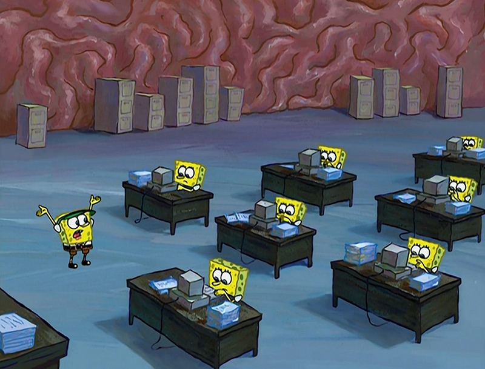

I am ambitious. At every turn through my corporate journey, I asked myself which path would lead to the best outcome. My optimization metric was usually money: which position would be best for negotiating a higher salary? I grew from a Software Engineer to a DevOps Engineer and eventually became a team lead. Meanwhile, I transitioned from a happy and inspired individual to burnt-out and sad.

Then, I quit working. I bought a car and drove to Sweden. Initially, I planned to do some personal programming projects, but I’d lost motivation. In Sweden, I used Meetup to meet up with many different people and groups. I quit my digital life and replaced it with a physical one — quite the opposite of what I was doing before.

Now, I reflect on the difference between the two lifestyles. Any lifestyle, when adopted for long enough, causes significant neural changes. When I was working, my brain was optimized for professional growth. I adopted a growth mindset and chased professional skills. Now, diving deeper into the social domain, I learn how it affected my skills in life beyond the professional field.

This made me think of Spongebob.

…wait, what?

It must’ve been at least fifteen years since I watched Spongebob. But somehow, my brain made a neural connection to a Spongebob episode. It’s weird how the brain retains these things and can relate my reflections to a silly kids’ show.

Spongebob is a cartoon about a sponge in the ocean. He works in a restaurant. In one episode, he gets an order from his boss to “forget everything that isn’t related to fine dining”. Following that statement, we zoom in on Spongebob’s brain, illustrated as an office with workers.

They shred everything irrelevant to the job: childhood memories, hobbies, etc. After that, Spongebob performs excellently on the job. But then, he is asked for his name. His mind goes into overdrive, as he’s forgotten everything unrelated to “fine dining”.

Yeah, it’s a silly metaphor, I know. But there’s some truth to it. Work has been the number one thing on my mind for the past five years. Anything in a professional context is effortless for me. But now, in Sweden, interpersonal skills are way more important. And I notice that I’m far behind on those.

…but I can learn.

So to avoid Spongebob’s fiery brain office, I’ve been focusing on reviving those skills lost to years of overworking. And these past months have been transformative. I met people from all strands of life, not just people in tech. I learned skills far more important than I could ever learn in the office.

Challenges are everywhere. Just because something is challenging doesn’t mean it leads to improvement. We need to pick those challenges that are in the domain in which we are not yet skillful, maybe even which requires significant discomfort and effort to breach, but which can lead to significant improvement down the line. For me, that area wasn’t DevOps or leadership. Although those were skills I had to learn, they were safely inside my comfort zone. The real improvement lies outside the comfort zone. For me, it is social relations and dealing with past traumas.

So now, I choose to learn ‘life skills’. There’s a long way to go for me to get there. But I’m taking steps, day by day.