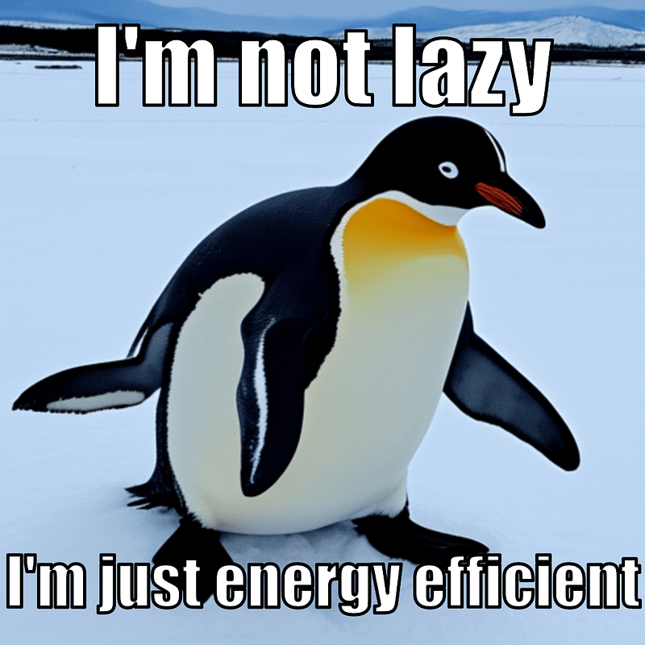
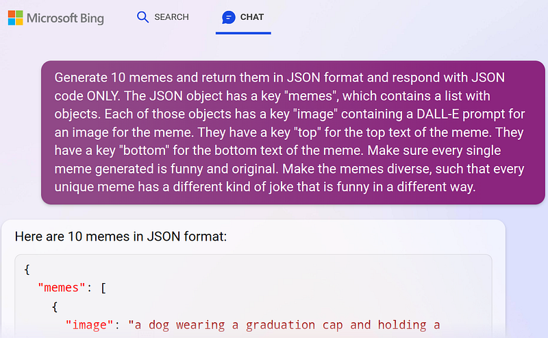
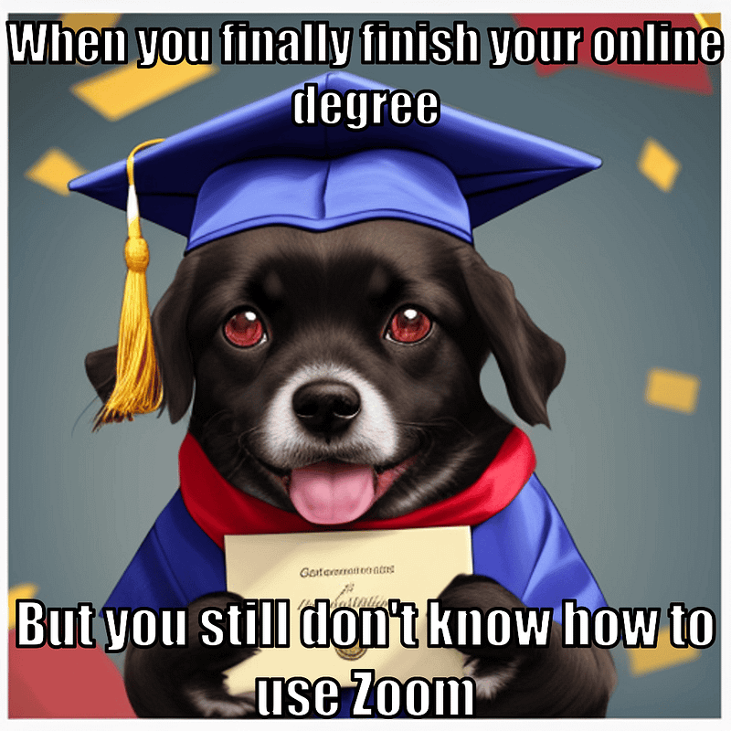
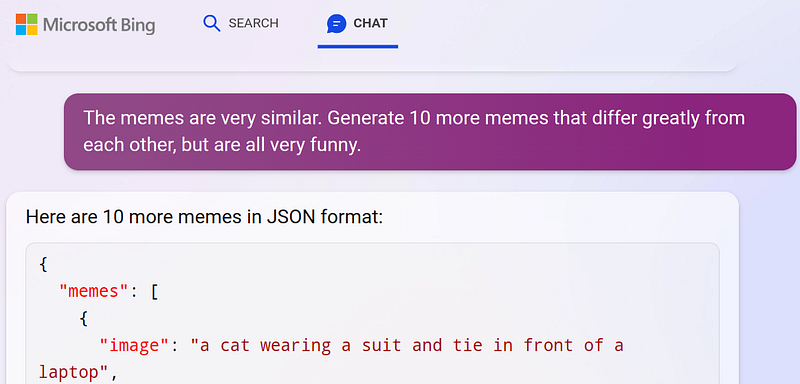
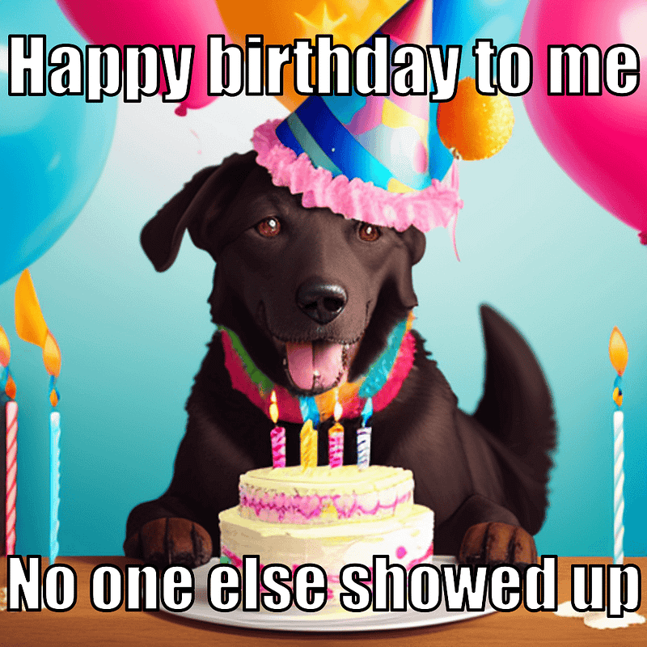
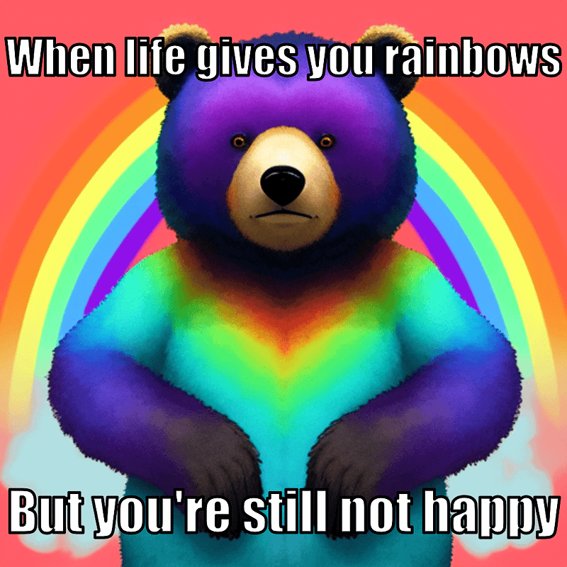

> “Holy shit, this is going to change the world.”

That’s something I hear a lot from people when they first try out ChatGPT. On their first tries, people usually give ChatGPT a simple creative task, like writing an article about a specific subject. But when it comes to actually changing the world through these tools, we have trouble coming up with the right thing to ask.

Since I delved into the world of generative AI, I’ve had occasional epiphanies when it came to something to try to ask ChatGPT, which I hoped to lead to a way to transform a domain. But for most of those things, it didn’t really work out the way I hoped. I tried to have ChatGPT compose music, but it couldn’t do it beyond simple chord patterns. I tried to design board/card games with ChatGPT, but its capabilities are not good enough for coming up with original constraint sets for such games.

Last weekend, I was playing around with AI-generated memes. The idea started with me discovering an Arch Linux (my favorite Linux distro) compatible meme-making tool called shitpost. I downloaded the tool and figured out that it was very simple to use:

shitpost - A tool to create memes using CLI  
Available options are:  
\-t: Top Text  
\-b: Bottom Text  
\-f: Path to image file

Only three CLI options. Easy enough. Next, I asked Bing AI to generate some memes in JSON format:

In the prompt above, you can see the way I usually like to format my prompts:

*   Start with the expected output.
*   Define exactly what the output must look like.
*   When you ask Bing AI to generate a multiple of something, it’s likely to get stuck generating similar things. It tends to be a good idea to ask for a diverse output.

The output in this specific prompt was the following:

{  
   "memes":\[  
      {  
         "image":"a dog wearing a graduation cap and holding a diploma",  
         "top":"When you finally finish your online degree",  
         "bottom":"But you still don't know how to use Zoom"  
      },  
      {  
         "image":"a man with a shocked expression looking at his laptop screen",  
         "top":"When you accidentally send a meme to your boss",  
         "bottom":"Instead of your report"  
      },  
      {  
         "image":"a cat with sunglasses and a leather jacket riding a motorcycle",  
         "top":"I don't always ride a bike",  
         "bottom":"But when I do, I make it purr"  
      },  
      {  
         "image":"a woman crying while holding a glass of wine",  
         "top":"Me after watching Titanic for the 10th time",  
         "bottom":"I'll never let go, Jack"  
      },  
      {  
         "image":"a baby with a fist in the air and a smile on his face",  
         "top":"When you wake up from your nap",  
         "bottom":"And realize it's Friday"  
      },  
      {  
         "image":"a man dressed as a leprechaun holding a pot of gold",  
         "top":"Me on St. Patrick's Day",  
         "bottom":"Feeling lucky"  
      },  
      {  
         "image":"a goat with a crown and a scepter sitting on a throne",  
         "top":"Behold, the king of the farm",  
         "bottom":"All hail his royal goatness"  
      },  
      {  
         "image":"a woman with a face mask and gloves holding a roll of toilet paper",  
         "top":"2020 be like",  
         "bottom":"Survival of the fittest"  
      },  
      {  
         "image":"a penguin wearing a tuxedo and a bow tie",  
         "top":"How I think I look when I dress up",  
         "bottom":"How I actually look"  
      },  
      {  
         "image":"a bear with a hat and a fishing rod sitting on a boat",  
         "top":"Just a bear necessities",  
         "bottom":"The simple bear necessities"  
      }  
   \]  
}

Here’s an example meme from this set:

Not bad. Now we have the desired output format established, we can simply ask Bing AI to “generate more memes” and it will generate a bunch more. I noticed when doing that, Bing AI sometimes gets stuck generating memes that are very similar to each other. Adding some extra encouragement to generate diverse memes usually does the trick:

Now we get this:

{  
   "memes":\[  
      {  
         "image":"a cat wearing a suit and tie in front of a laptop",  
         "top":"I'm not a cat",  
         "bottom":"I'm here live"  
      },  
      {  
         "image":"a dog with a birthday hat and a cake",  
         "top":"Happy birthday to me",  
         "bottom":"No one else showed up"  
      },  
      {  
         "image":"a baby with sunglasses and a leather jacket",  
         "top":"I don't always drink milk",  
         "bottom":"But when I do, I prefer the breast"  
      },  
      {  
         "image":"a penguin sliding on its belly on the ice",  
         "top":"They see me rollin'",  
         "bottom":"They hatin'"  
      },  
      {  
         "image":"a woman yelling at a confused cat at a dinner table",  
         "top":"You said you wanted to try something new",  
         "bottom":"This is salad, Karen"  
      },  
      {  
         "image":"a man holding a sign that says 'I'm not homeless'",  
         "top":"",  
         "bottom":"I just need money for more memes"  
      },  
      {  
         "image":"a bear holding a fish in its mouth",  
         "top":"",  
         "bottom":"One does not simply walk into Mordor"  
      },  
      {  
         "image":"a frog with a cup of tea",  
         "top":"",  
         "bottom":"But that's none of my business"  
      },  
      {  
         "image":"a woman looking at two buttons with sweat on her face",  
         "top":"",  
         "bottom":"Bing or Google"  
      },  
      {  
         "image":"a man pointing at his head and smiling",  
         "top":"",  
         "bottom":"(insert clever caption here)"  
      }  
   \]  
}

Here’s an example meme from this set:

Very funny! LOL! ROFL!

Now we have a proof-of-concept, it’s time to automate it. We want to transform the world after all, so we’ll want to generate millions of memes. That should be enough to flood the internet with shitty content for years to come.

I made a script that uses a [NodeJS library](https://github.com/waylaidwanderer/node-chatgpt-api) to communicate with Bing AI. First, I ask the above prompt, and then I keep asking the follow-up prompt to generate more memes till we reach the limit of 20 messages, and then do it all again. We save every JSON output as a file. Sometimes, our request is rejected or it responds with something that does not resemble valid JSON, which I simply discard and try again.

Next, we take all the JSON files and read the “image” fields. Each image prompt goes through [Stable Diffusion WebUI](https://github.com/AUTOMATIC1111/stable-diffusion-webui), a free text-to-image API. For the example images I used a model named [Dreamshaper](https://civitai.com/models/4384/dreamshaper), but really any stable diffusion model would suffice. You could use DALL-E in the cloud if you’re lazy or don’t have a beefy GPU.

After generating the images, I run the shitpost CLI tool to add the top text and bottom text to the memes. Putting all of it together, we have a pipeline that automatically generates memes.

This was just a silly experiment of a pipeline combining GPT and Stable Diffusion. I still have to come up with the million-dollar idea that truly changes the world as we know it. But it was a fun experiment.

If you are curious about the code, I open-sourced all of it on GitHub: [https://github.com/SimonBaars/AI-Generated-Memes/.](https://github.com/SimonBaars/AI-Generated-Memes/.) On that page, you can also find a demo folder, which contains 140 memes generated with the tool. Feel free to share a couple of memes you generated with it! And maybe you can use the code for other, more useful, applications.

Stay cool!