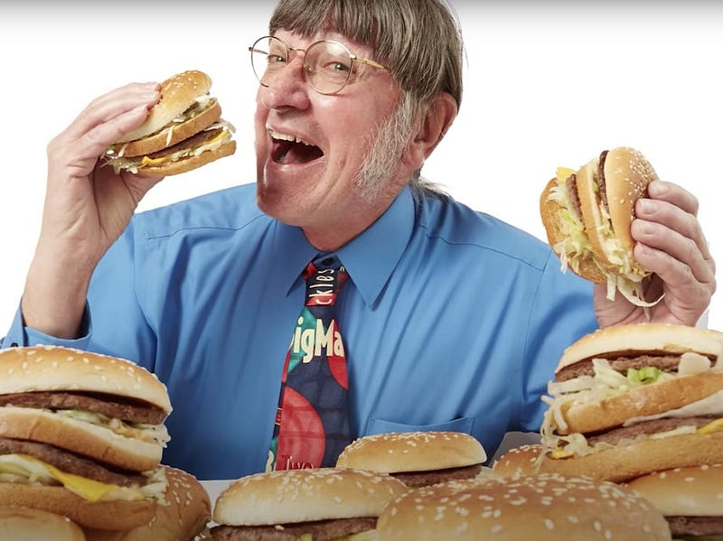
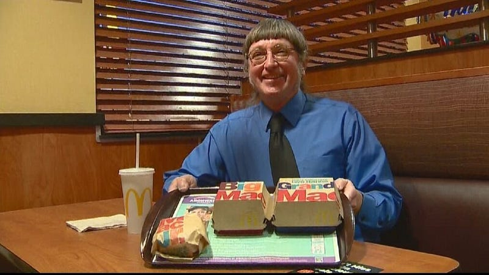

Don’t talk to me.

I’m a terrible person to talk to. If you talk to me about shallow topics, like vacations or the weather, you will see me tune out in seconds. But if you show even the tiniest openness to having a deeper conversation, I’ll bore you with my weird philosophical analyses for hours. Among them is finding the meaning of life.

The meaning of life is something many people wonder about. [Some think it’s 42](https://simple.wikipedia.org/wiki/42_%28answer%29). [Others think it’s a ham sandwich](https://markmanson.net/the-meaning-of-life). I was never really sure. But I knew having a meaning in life is important: only instant gratification doesn’t get us far. But then, one day, watching trash videos on YouTube, I found the meaning of life. And I found it while watching the YouTube video of the guy who holds the world record for eating the most Big Macs.

Some may not regard the guy in the above picture as the pinnacle of success. But I do. Look how happy he is. And it’s not just that he is a world record holder. It’s that he has found something that gives his life meaning. The number of Big Macs he has eaten is not just a number: it’s his life. He collects the boxes of all the Big Macs, keeps all the recipes of his orders, and has a fantastic collection of rare Mcdonald's items. That’s dedication.

This man has found something he loves and completely indulges in his passion. And I think we can learn from him. He shows that meaning in life is a deeply personal thing: we can formulate no single meaning for everyone. He also shows that we have to make sacrifices to chase what gives us meaning. For him, it means having an active lifestyle to offset his calorie intake.

Now, what’s your passion? For some, it’s family. For others, it’s traveling. For me, it’s having novel experiences, no matter the kind. Once you figure out what your passion is, allow yourself to indulge in it. Define yourself by your passion, and you will soon find the meaning of life.