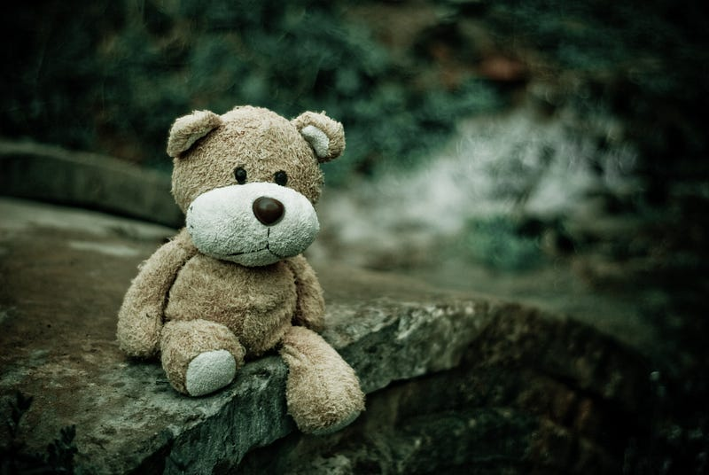

This year, I decided to live on the move.

As a software engineer, I have the flexibility to work from any location. So I’m making a road trip through Europe, staying in a different AirBnB every month. But before I could embark on this adventure, I had to face a daunting challenge: clearing out my bedroom at my parent’s place.

Over twenty-six years, I accumulated all kinds of stuff: closets full of past hobbies, artifacts displaying achievements, lots of tech stuff, etc. Now I had to decide what to keep and what to discard. I could only take what I could bring along for the trip.

It was painful to throw away so many things that once meant something to me. But it was also eye-opening. I realized how much money I wasted on stuff I had hardly used, if not the pointless consumerism with all its negative implications.

_Why do I buy this crap?_

I think I bought things because they made me feel good at the moment. I imagined using them more than I actually did. But in reality, I spent most of my time using my laptop. So whatever I bought would end up gathering dust in some corner.

_What do I learn from this?_

I learned that buying something incurs a time commitment. When you purchase something, you should ask yourself: how long should I use this to make it worth the purchase? Then, ask yourself what concrete evidence you have that you will be using it for that time. Do you really have enough time and interest to enjoy it? Or are you just buying it for the thrill of owning it?

I’m glad I cleared out my bedroom. It was hard, but it was also liberating. I feel lighter, freer, and happier. I don’t miss any of the stuff I threw away. I only look forward to the experiences I’ll have on my road trip.

What about you? Are you ready to let go of your stuff?