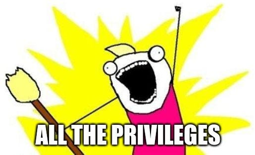
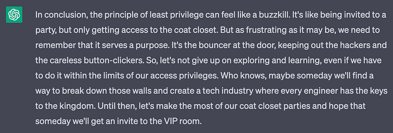

**Permission denied** — how often have you seen that in the past week?

For me, the answer would be **almost every day**.

If you work for any modern company, chances are that you’ve run into security walls at one point or another. What follows is a flurry of sending messages around to different people, in the hopes of gaining access or someone else solving our problem by the end of the week. And it’s usually not really an isolated occurrence: for some tasks, it sometimes happened to me several times per day that I lacked permission to complete my task.

What has gotten us into this mess? Well, it’s the [principle of least privilege](https://en.wikipedia.org/wiki/Principle_of_least_privilege).

I deem this principle counterintuitive for several reasons:

*   It wastes everyone’s time
*   It hampers learning: we cannot venture out into the unknown and learn beyond our direct scope
*   It displays a lack of trust

So, how do we get out of this mess?

Let’s start by looking at the problem through cybersecurity glasses.

Most large system hacks originate from social engineering. A chain is only as strong as its weakest link. The podcast [Darknet Diaries](https://darknetdiaries.com/) has countless stories about hackers who study individual people who work for large companies carefully, in the hopes of finding a way in. An example could look like this:

*   Find the person with the permissions you want on LinkedIn, for example a Systems Administrator is always a good target to breach.
*   Find out as much as possible about that person, for example through their GitHub, Facebook, or other social media.
*   Obtain the target’s email, for example through breached databases, their GitHub commits, or just trying \[firstname\].\[lastname\]@\[company\].com.
*   Create an identical login page to the one that the target company uses.
*   Craft a highly personalized message requiring the user to log in to your fake login screen.
*   Profit.

But of all the many accounts of such social engineering attacks succeeding, I haven’t seen any that didn’t require someone to be **dumb** first. A proper software engineer should always carefully check the origin of an email. They should use autofill for randomly generated passwords on any website, such that spoof login screens won’t automatically autofill which is an immediate red flag. They should also know how to keep their laptops secure: a good software engineer shouldn’t need an antivirus or company policy not to install or run untrusted programs.

All of those things are part of the basics.

Apart from security issues, the principle of least privilege also protects against human error. And that sucks. Because making mistakes is the best way to learn. And for mistakes that have to be avoided at all costs: those only happen when people act **dumb**. When exploring unknown terrain (eg the thing you shouldn’t have access to), one must always be careful. Anyone who tries buttons at random, especially buttons that clearly perform _write_ operations, is unfit for the job.

Unfortunately, our mistrust is usually for good reason. There are plenty of engineers without a strong foundation in handling computers in general. And tech is sufficiently complex that it’s easy to even miss an obvious problem, potentially causing significant trouble down the line. That’s why organizations need these safeguards; they cannot harbor without them.

My utopia is a place where every engineer in an organization has full access to everything, and is qualified enough not to make major mistakes getting there. Till we reach that point, I’ll create my own company, where I’ll have full access rights by default. I can play with technologies to my heart’s content without a single **Access Denied** message blocking my way.

…and now over to ChatGPT for the ending, since I’m terrible at writing endings.

ChatGPT, take it away!

Well said, ChatGPT. Well said :)