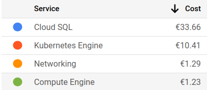

I recently started my first Cloud project from scratch as a DevOps engineer. I set up most of the infrastructure in a week, including a SQL database and two Kubernetes clusters. I thought I was doing well until I checked my GCP (Google Cloud Platform) billing account the next week on Monday and saw that I had spent 100€ of my trial credit over the weekend.

I was shocked. How could two idle databases and two barely used clusters cost so much? I quickly realized that I had made a mistake by choosing the default settings for everything. The default settings allocated more resources than I needed, such as RAM and CPU. I scaled down everything to the smallest tier possible, but the costs were still a few euros per day. That was too much for me, considering that my project was not getting any traffic yet.

I decided to look for a better solution. I wanted to pay only for what I used, not for what I reserved. I wanted to go serverless.

Serverless means that the platform handles the allocation and management of resources for you. You only pay for the actual usage of your application, not for the idle time. Serverless also scales automatically with demand, so you don’t have to worry about over- or under-provisioning.

I migrated from **Kubernetes Engine** to **Cloud Run**, which is GCP’s serverless container platform. Cloud Run runs your containers on demand, only when they receive requests. It’s a bit less flexible than Kubernetes, but it’s perfect for my use case since I don’t need much customization.

I also migrated from **Cloud SQL** to **Firestore**, which is a serverless NoSQL database. Firestore stores and queries your data in real-time, without requiring any servers or schemas. I initially chose SQL (Postgres) because it’s the database I’m familiar with, but it turned out to be too expensive and complex for my needs. Firestore is simpler and cheaper, and it works well with Cloud Run.

Here are some lessons I learned from this experience:

*   Don’t blindly trust the default settings when creating cloud resources. Think about what you really need and choose the appropriate options.
*   Choose serverless solutions whenever possible, especially if you expect low or variable traffic for your project.
*   Always use free trials to test your infrastructure and estimate your costs before committing to a plan.
*   Don’t stick to the tools you know if they don’t suit your needs. Explore different options and find the best fit for your project. [(I am biased)](https://medium.com/@simonbrs/software-engineers-are-biased-and-its-ruining-our-software-b5bd61fbbfd2)

I hope this article helped you understand how to avoid high Cloud bills with serverless solutions. Serverless is not only cheaper but also easier and faster to use. You can focus on your code and let the platform handle the rest. Serverless is the future of Cloud computing, and I’m glad I made the switch. Now I can sleep better at night, knowing that I’m not wasting money on unused resources. And I can also enjoy my weekends without worrying about my GCP account.😉