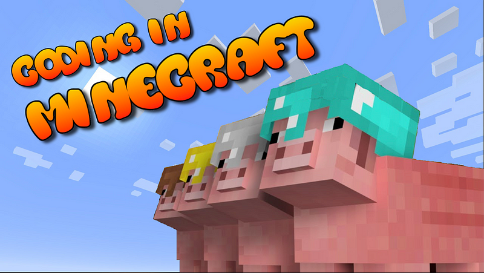

I was thirteen when I first played Minecraft. A friend introduced me to the game, and I was instantly hooked. I spent countless hours exploring, building, and surviving in the pixelated worlds. My grades suffered, but I didn’t care! I was having too much fun. And little did I know that this game would ignite a passion that would shape my life. Because Minecraft taught me how to code.

Minecraft is a game of infinite possibilities. You can create anything you can imagine, from castles to spaceships, from farms to roller coasters. But after playing for hundreds of hours, I started to get bored. I wanted more. I wanted to change the game itself.

That’s when I discovered modding. Modding is the process of modifying the game’s code to add new features, items, or mechanics. I followed some tutorials online, and before I knew it, I was staring at the Minecraft source code:

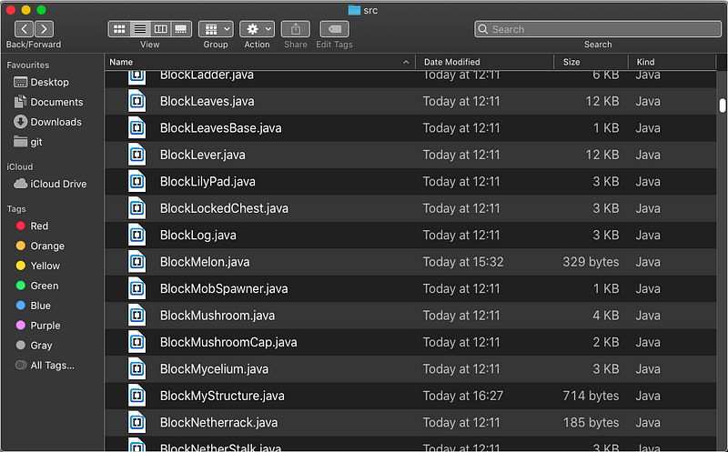

My IDE of choice was Notepad, which came preinstalled on Windows. Very convenient that they’d ship such an advanced IDE with the operating system. Notepad has all kinds of neat features, like editing text and Copy&Paste™. What more could a developer ever need?

Carefully, I started looking at the files. I wanted to start with something simple. I kept opening files till one of them seemed simple enough. The block I landed on was a melon:

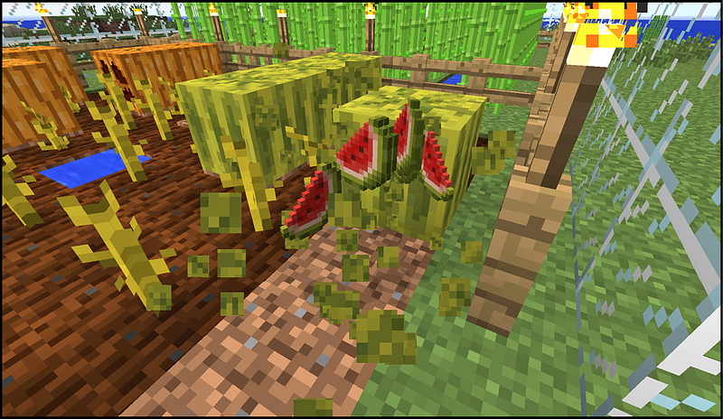

When you break a melon it drops a couple of melon slices. I wanted to change that behavior such that it would drop more slices. Yummy! 🍉

The melon file looked something like this:

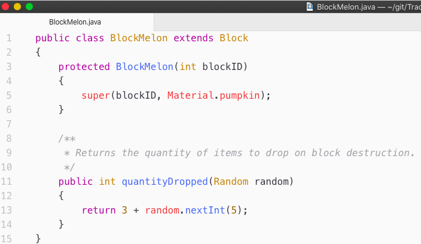

Now, imagine that I was fourteen years old at the time, and had never seen a single line of code. I didn’t know what the heck I was doing, but I saw some numbers and thought that changing it to a different number could elicit a response. I changed the 3 to 100, hoping for a shower of melon slices upon the destruction of the melon:

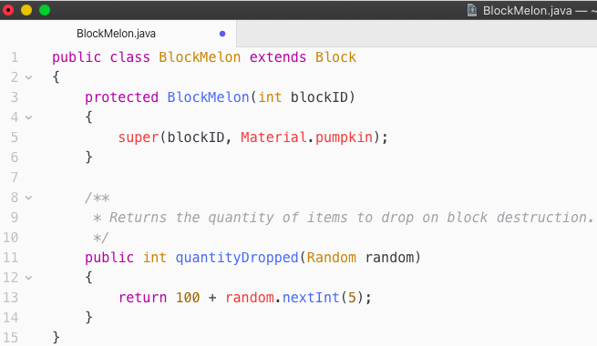

Miraculously… it worked!

I was showering in sweet melon-slice goodness. 🍉

Now, at this point, I felt indestructible.

Who’s the captain now? That’s right! ME.

This world now bends to my rules. Whatever I type will be the new reality.

With trial and error, I kept looking through the files and making changes. The next file where I found something interesting was the file containing the code for the sugar cane. In Minecraft, sugar cane grows over time:

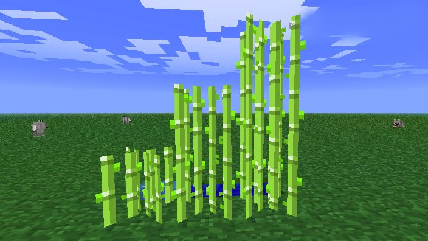

The code for it looks like this:

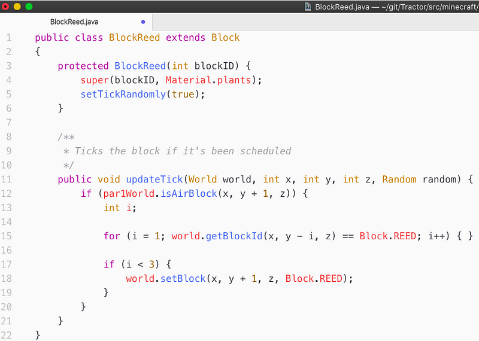

This code was way too much for my fourteen-year-old mind. From Minecraft itself, I kinda understood how coordinates work. From there, I understood that y was height, and x and z were the other dimensions:

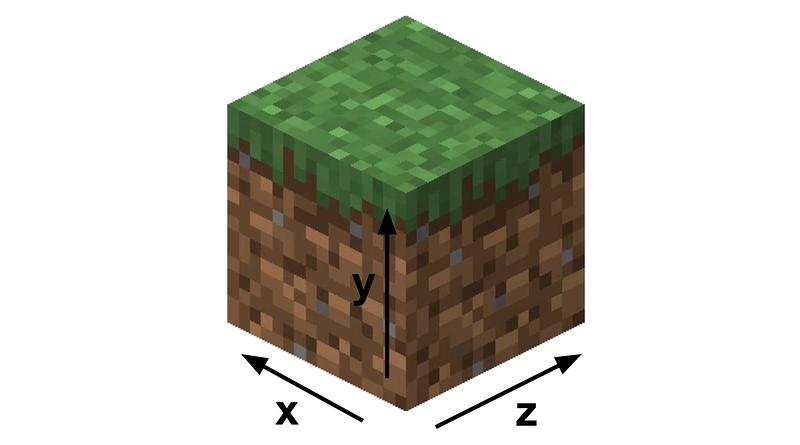

The line that stood out to me was line 18, where it says `world.setBlock` and then an `x`, `y`, and `z`. I wondered whether this would allow me to place blocks in Minecraft. I changed the `Block.REED` to `Block.STONE` , and miraculously, the sugar cane grew stone instead of more cane.

Now I knew how to manipulate the world, it was time to build something. I planned to start off with something simple: a little tree. My design was as follows:

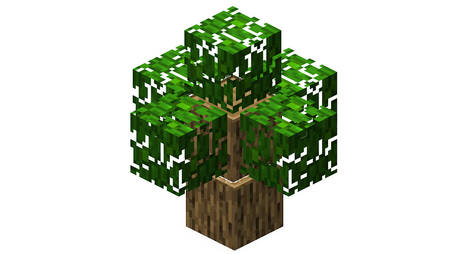

This design contains the following:

*   One block of wood on y=0
*   One block of wood on y=1, and four blocks of leaves on y=1
*   One block of leaves on y=2

I then sketched it out as follows:

**Layer 1**

**Layer 2**

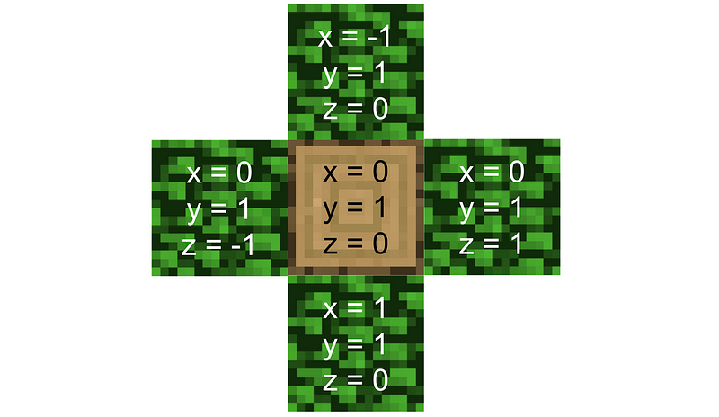

**Layer 3**

After making the sketch, I turned it into code:

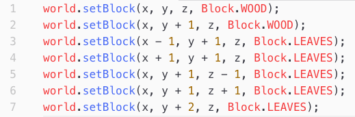

I pasted that in the code for the sugar cane, and watched in awe as the sugar cane grew a little tree.

That was my first creation with code. And I was proud of it.

But I wanted more. I wanted bigger. Much bigger. MASSIVE even.

My first MASSIVE building was going to be a pyramid. I grabbed a sheet of A4 paper and drew as much as the size of the paper allowed:

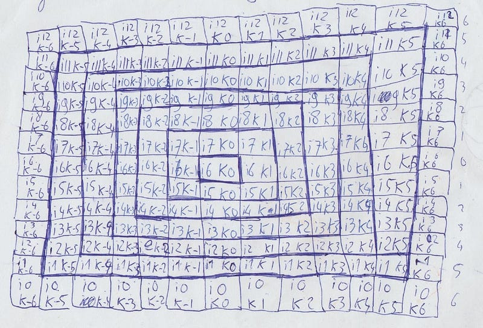

A true aesthetic masterpiece. Next, I made a list of all coordinates that I had to copy into the computer:

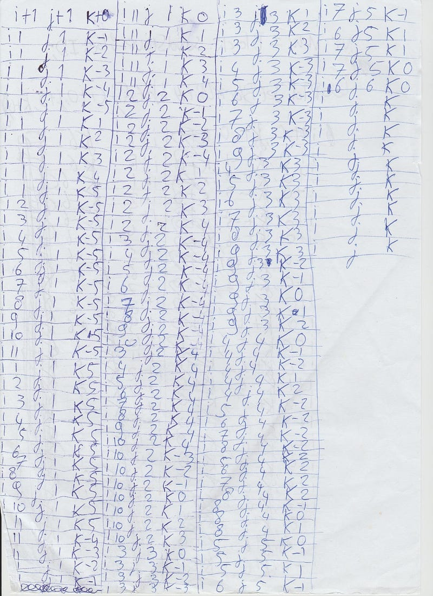

I turned the coordinates into code, pasted it into the code block for the sugar cane, placed the sugar cane, and watched in awe as it grew into a full-blown pyramid:

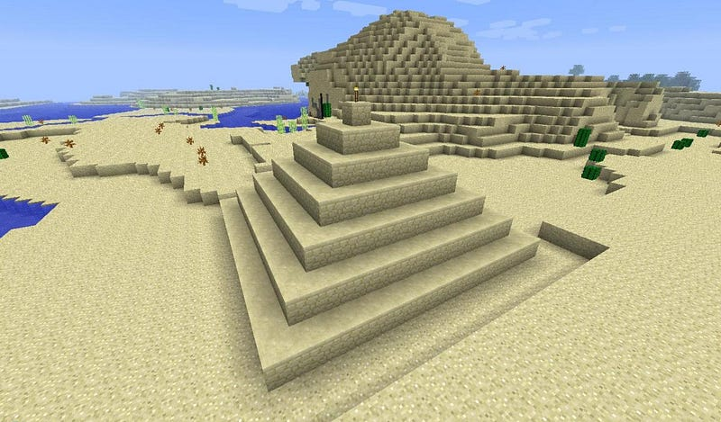

At this point, I was mind-blown.

I started sketching way more such structures. I couldn’t wait to share it with others. I made a post on PlanetMinecraft, a forum for sharing Minecraft creations, and hit “publish”. Little did I know it would completely blow up.

A couple of weeks after I posted my creation, a popular YouTuber reviewed it:

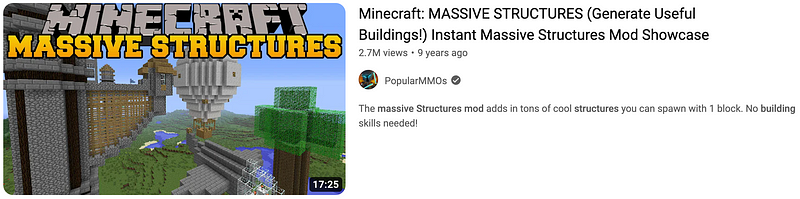

This video racked up more than 2 million views, and got a lot of people, among which more YouTubers, to try out what I made.

At this point, I had the presence of mind to add a little advertisement before the download page, so that I could earn a little bit of money with it. I used a service called “Adf.ly”, which pays quite poorly, but given the millions of downloads, it still amounted to quite a bit of money:

Now that I had tasted success, I wanted more. What followed was a time of frantically experimenting with different things. At some point, I got the idea to “animate” the structures by repeatedly running the `setBlock` in different locations, which would make it look like a structure was moving:

When I released that change, it completely blew up, with YouTube reviews racking up more than 50M views:

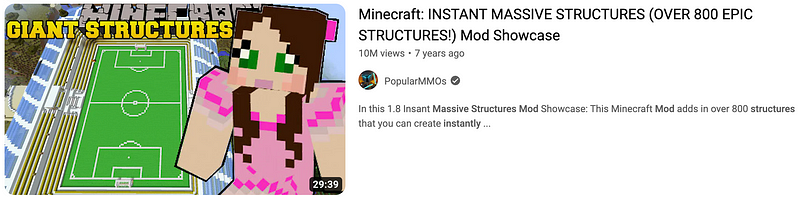
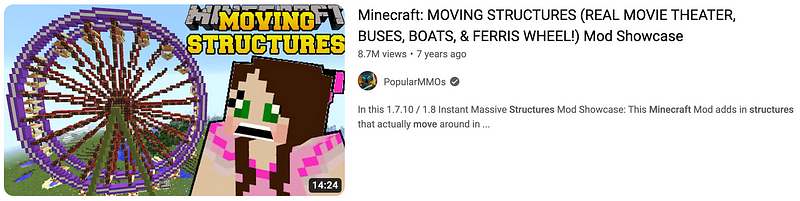

It was a very wild experience to suddenly have something I made become so popular. It was a double-edged sword, in a way:

*   I felt special and had discovered a passion
*   [I desperately wanted more such successes](https://medium.com/@simonbrs/living-in-the-shadow-of-success-293b5b9db6d4)

After making something so popular, I tried many times to make similarly popular things. Unfortunately, this creation becoming so popular involved quite a bit of luck, which wasn’t as much on my side in later creations. Also, my expectations were set sky-high, which also didn’t help.

At some point, I lost interest and shifted my focus to school and work. I landed a master's degree with honors and continued my career with a well-paying job.

But none of it could rekindle the passion I once had when modding Minecraft.

What Minecraft taught me is that deep in my heart I’m a creator. I’m driven by making awesome things and sharing them with the world. Back then, I did it by writing code for Minecraft, which led me to a career in software engineering. But software is just one medium for my creativity. I can create with words, sounds, images, or anything else.

I am a creator.

And I will create.

Even if it means breaking a few melons along the way.🍉