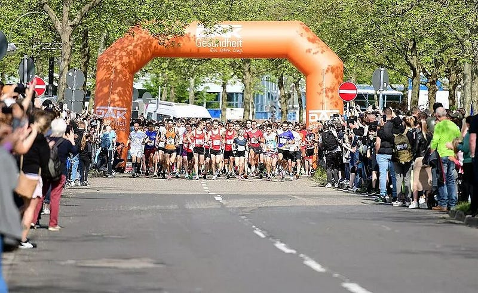

Imagine this: a running race is about to begin. Five thousand eager participants are lined up, waiting for the countdown to start. The sun is blazing in the sky, adding to the challenge ahead.

At the front of the crowd are the elite runners. The ones who train regularly, with sophisticated interval programs. The ones who join athletics clubs to master the perfect techniques to run faster. But among them, there is an impostor. He looks around nervously, comparing himself to the people who clearly know what they are doing.

And that impostor… is me.

As I stand there, my mind is telling me that I don’t belong in this position. Sure, I run decently. But look at these people! They are practically professionals. I don’t stand a chance against them. I will only slow them down.

Then the announcer says that the race will start in ten seconds.

All of a sudden, the runners around me disappear from my awareness. I press ‘play’ on my mp3-player. The earphones blast my favorite running track. My heart rate spikes.

_\*BANG!\*_

The starting gun goes off and I sprint forward. Driven by my music, I manage to keep up with the group of experts. Actually, they don’t matter anymore. This is my race. And right now, I’m flying.

As the race goes on, people settle into their positions. The ones who started too fast fall behind. Somehow, I end up alone. There’s nobody within ten meters of me, ahead or behind. About fifteen meters in front of me is a group of runners. I could join them with a bit of effort, but I’m already running at my optimal pace. So I stay on my own.

With extreme focus, I fight my own battle. I keep my breathing and arm movements steady. My throat is dry because of the heat but I try to ignore it as much as I can. I check my watch several times to make sure I’m not slowing down. 3:30 is the pace I aimed for, so 3:30 I run.

Somehow, I keep it up. Pushing through the pain, I give it my all near the finish to overtake a runner who lagged behind the group. I finish thirteenth, which is totally worthy of the front group. The same group that I couldn’t relate to earlier. Somehow I, a complete running novice, am one of them.

Only after I crossed the finish line, the rest of the world came back into view. Apparently, a group of people I knew was cheering near the finish line, but I hadn’t noticed them. I was so absorbed in the game that everything else just faded away.

I don’t run for fun. Running, and especially such a race, is pure agony for me. In the days leading up to the race, I dread the upcoming challenge. During the run, I set an uncomfortable pace right away, and the whole game is about avoiding a mental breakdown as the discomfort steadily increases. If I don’t run well, I’m incredibly disappointed in myself.

So why don’t I just take it easy and enjoy it for once?

Because I need to be the best I can be. Because there’s strength in pain, and I need all the strength I can get. And also because I crave social validation. But that last one I don’t really like to admit.

That doesn’t mean my whole day was ruined. Just thirty minutes of the day were unpleasant. And that unpleasantness made the rest of the day awesome. I also have a wonderful memory to look back to, in which I’m the hero of my story, battling through pain to achieve a personal victory. It’s meaning to my life that a comfortable run could never give me.

So next time you see me at a running race, don’t be surprised if I’m at the front of the pack. I’m not an impostor. I’m just a masochist with a passion for running. And a secret desire to impress you.