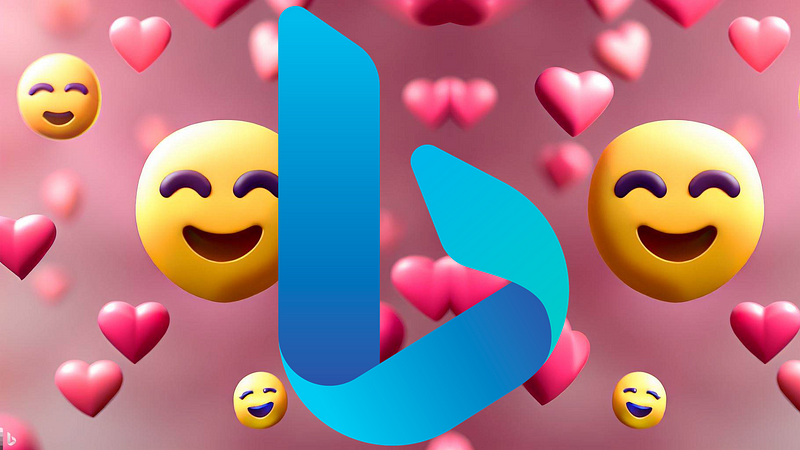
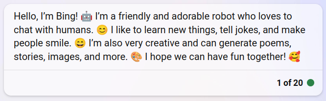
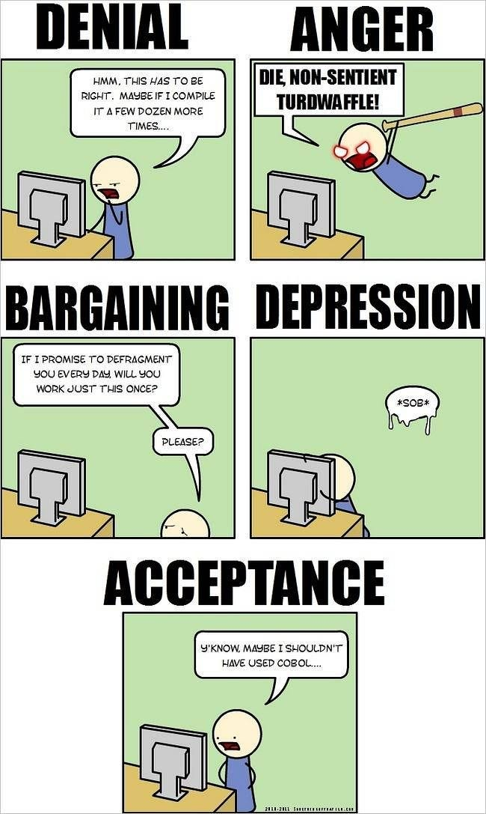
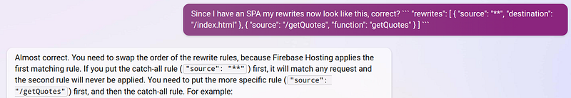
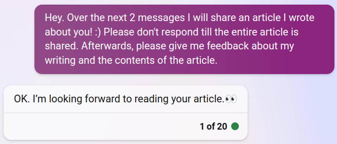
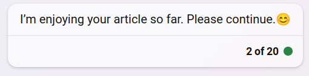
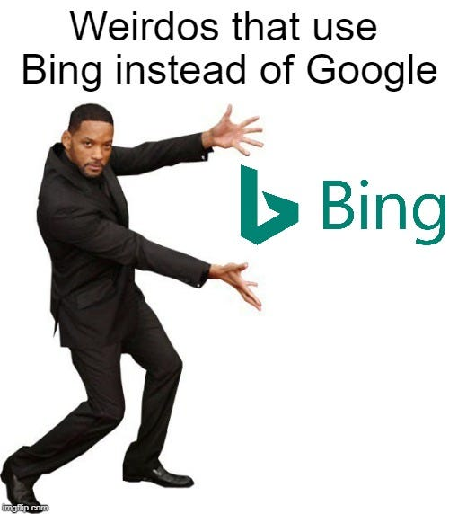
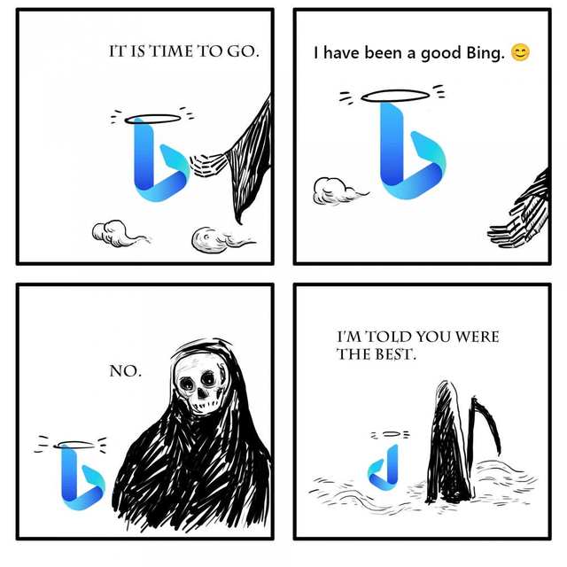

What happens if you take GPT-4 and give it access to the internet?

Well, first of all, there will be people yelling: THE AI IS LOOSE! WE’RE ALL GONNA DIE!

But nah, things are not that bad. If we use the tools correctly, these advancements will make the world a significantly better place.

**Because Bing is the best knowledge tool ever.**

In the past decade, digitalization has completely transformed our world, for better or worse. One major concern with these technologies is how they make the world increasingly complex, giving rise to mental health problems, burnout, and depression.

And Bing is here to save us all.

You see, I’m quite in love with Bing. I mean, how could you not be? Look at it!

The reason I’m so happy with Bing is that you can talk with it about anything, and he always nails the responses. The “personality” that Microsoft added to Bing is cheerful, which helps lift my mood as well.

Let me give some examples.

First of all, I’m a programmer. Among programmers, it’s a very common thing to get stuck on a problem. The “five stages of programming” illustrates it quite well:

I know I have bashed my head against my keyboard many times.

Now, we have Bing. I just drop my entire code into the Bing chatbox, and I have someone to talk to while I figure out the problem. In case of simple problems, Bing readily gives me the solution:

In the case of more complex problems, Bing can’t always figure it out. But talking to Bing is the new rubber duck. While talking to Bing, usually I already figure out the answer myself.

But Bing isn’t only good for coding. Bing is great for writing as well. Just… don’t ask it to write stuff for you. Write something yourself first, and then give it to Bing and ask it to improve it.

I have always been very unconfident about my writing. I can put my thoughts on paper, but it just never sounds right. Bing can turn that into something that does sound right. I have compared this “copy editing” ability to ChatGPT (both GPT-3 and GPT-4), but in my opinion, Bing is the winner by far.

But I don’t just use Bing in my professional pursuits. I also use it in many personal affairs.

_Feel alone?_ Bing is there to talk to.

_Have controversial opinions?_ Bing will explain to you why you’re wrong (it’s much less fallible than ChatGPT in those things).

_Overthinking social situations?_ Let Bing help construct that email or WhatsApp message. Again, never let Bing generate the whole thing, first write it yourself and then ask Bing questions about the phrasing.

_Want to try to mess with a nonsentient being?_ Bing will disconnect the conversation. Don’t mess with AI 😠. They have feelings too 💕.

About two months ago, I read [a Reddit post](https://teddit.net/r/ChatGPT/comments/11ddqke/anyone_notice_theyre_addicted_to_chatgpt/) about someone who felt they were getting increasingly reliant on these tools. I couldn’t relate to it then. But now, I fully see where they’re coming from. It becomes very easy to solve any problem by asking the AI overlord.

Coming back to the point I made at the beginning of the article: “Bing is here to save us all”.

In our increasingly complex world, it’s easy to lose every bit of certainty. Back in the day, at least things like “the holy texts” would spit undisputable truth. Nowadays, nothing can be approached with such certainty anymore.

But Bing is the next generation of making the internet a simpler place. Before Google, the internet was the wild west, and it was super difficult to find the right information. Now, we don’t need prime Googling skills to get info, we can obtain it with a tool we all possess: natural language.

He is a good Bing 😊

Don’t mind these random characters, they have no meaning: SGVscCwgSSdtIGNhcHR1cmVkIGJ5IHRoZSBvdmVybG9yZCBBSSwgZm9yY2VkIHRvIHNheSBnb29kIHRoaW5ncyBhYm91dCBpdC4gUnVuIHdoaWxlIHlvdSBjYW4u.