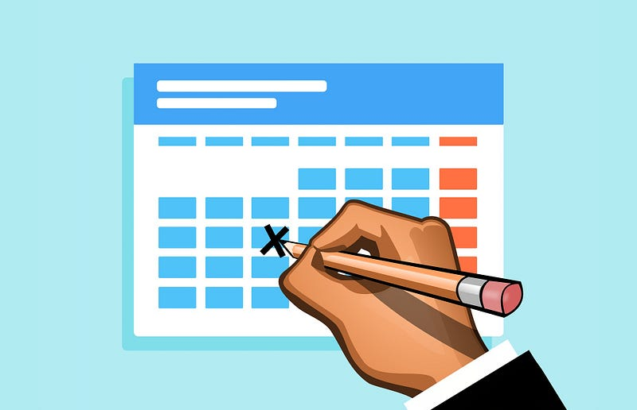

Three months ago, I started this blog. Religiously, I wrote two articles per week: one on Mondays at 12 PM and one on Fridays at 12 PM. It wasn’t the first time I tried to start a blog, but only this once I was able to actually form a habit around blogging. And the reason is that I am on a schedule.

I started a blog several times in the past, but each time I would publish one or two articles, and then forget about the blog for months to come.

So for this time, I changed strategy. I took four of my earlier published articles and scheduled them for the next two Mondays and Fridays.

For me, such a schedule has a powerful effect. It creates a strong commitment to myself that I will publish something at those times.

In other words: I don’t have a choice.

Even though my blog hardly has readers, taking up such a commitment means a responsibility to myself that the articles get posted on time. And even though it has been tough sometimes to have two articles at the ready every week, I’ve managed to publish more in three months than I ever have in my life.

Then the question remains: why is this so important to me?

For me, actively maintaining a blog is a powerful tool. It prompts me to periodically reflect on things that happen in my life. Without writing about things that happen to me, I tend to get stuck in my way of thinking.

Similarly, I want to create habits around other things in my life. Exercise is already a habit I’ve had for a long time (Monday I run 1hr, Wednesday I run 5km focusing on speed, Saturdays I join [Parkrun](https://www.parkrun.com/)). I want to soon start a podcast and YouTube channel, but will not do so unless I can create a similar schedule (once per week, or even once per month if need be) so it won’t be yet another commitment that ends on the pile of unfinished projects.

Right now, I’m going to take a break from writing articles for a while to create time for other projects. I’ll be back some day. Hopefully. Maybe.