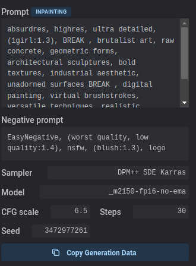

Have you tried building a ChatGPT + Stable Diffusion pipeline? And do the images never turn out just right?

Been there, done that.

For an interactive storytelling application I’m building, I’ve experimented with methods to have ChatGPT generate Stable Diffusion prompts, and the results have varied.

So hereby I present to you: the do’s and don’ts of ChatGPT + Stable Diffusion pipelines.

#### Do: Clean the prompts

For my interactive storytelling app, I ask ChatGPT something along these lines:

Write two paragraphs continuing the story if the player chose the "{optionName}" option. Format the response as follows:  
  
\- Name: Unique name for this story segment  
\- Paragraph 1: First paragraph  
\- Image 1: Image prompt for this paragraph  
\- Paragraph 2: Second paragraph  
\- Image 2: Image prompt for this paragraph

For the images, you can see that I ask for an “image prompt for this paragraph”. I tried different prompts, like “a stable diffusion prompt”, “a text that describes the image” or even “comma-separated keywords that describe the scene of the paragraph”, but the results were all similar. What results are prompts like this:

A person laughing while holding a whoopee cushion, ready to play a prank.

But sometimes, quite randomly, the prompt takes a different format, like:

An image of a man hauling on a rope while the ship rocks back and forth on choppy waves.

or

A DALL-E image of a person nervously wiping their forehead with a sandwich while looking at a watch.

Tokens like “An image of” and “A DALL-E image of” confuse Stable Diffusion, so I made a function that cleans the prompts (JavaScript):

function capitalize(string) {  
    return string.charAt(0).toUpperCase() + string.slice(1);  
}  
  
function removeDot(string) {  
    if(string.charAt(string.length\-1) == '.') return string.slice(0, -1);  
    return string;  
}  
  
function clean(text) {  
    return removeDot(capitalize(text.replace(/An image of |DALL\\-E prompt \\- |A DALL\\-E image of |A DALL\\-E generated image of |A picture of |A DALL\\-E\\-generated image of /g, "")));  
}

After introducing this function, the results became significantly better.

#### Don’t: Use photorealism

One of the stories in my application is a war story. For it, I decided to try out a photorealistic model ([Realistic Vision](https://huggingface.co/SG161222/Realistic_Vision_V1.4)) and use it to generate the story’s images. What resulted was a gallery of silly faces:

I decided to take on the content moderation hell that ensued, and out of 6498 images in the story I had to manually reject 1599, which took a very long time. For me, the whole point of creating automated pipelines is minimizing manual effort. Having to do extensive content moderation doesn’t help.

There are a couple of ways to improve faces (I had fix\_faces and upscale turned on, but still…), and most of the photorealistic images turned out fine, but I couldn’t find a way to get consistently good results.

#### Do: Tweak the negative prompt

With these kinds of pipelines, some manual moderation is always necessary. However, if you see any unintended features, it’s generally very easy to counter them through the negative prompt. Let’s look at some examples:

Sometimes, a bit of heads-up-display tends to show. Adding negative embeddings on “HUD, heads-up-display, text” usually does the trick.

Sometimes, the models start making collages like this. Adding a negative embedding for “collage, split-view, split-screen, panels, comic panels” usually does the trick.

Sometimes the artstyle changes wildly. Either fix this through the positive prompt by clearly denoting the artstyle, or add a negative prompt for things like “drawing”.

Sometimes the result turns out like a poster. Negative embeddings like “poster, flyer, text” help avoid this.

#### Don’t: Use models optimized for anime girls

This seems like a silly point, but gosh is there a lot of bias in the interpretation of prompts. As I said before, photorealistic models still have a lot of flaws, and generally anime models perform consistently better in terms of image quality. The problem is that many images tend to turn out like this:

Yeah. -.-

Even with a negative prompt on “blush”, “big boobs” and “nsfw”, the models keep being biased towards generating girls with such features rather than the actual thing the prompt is intended to portray. Any prompt containing the words “nurse”, “bed”, “athletic”, “dance”, “beach”, etc. gives wildly different results than intended.

As much as I love the anime artstyle, often the models were just too biased to work with. To name a few: OrangeMixs, Waifu Diffusion, and anything-4.5, all contain heavy bias.

In general, I feel that Stable Diffusion models suffer heavy biases. “Soldier” will almost always turn out male. “Nurse” will almost always turn out female. I guess it’s to be expected, but still, not always what you want if you try to build an inclusive application.

#### Do: Use the demo images as inspiration

One of the places I get my models is [CivitAI](https://civitai.com/). For a recent pirate-themed story, I decided to go with the model named [BreakDomain](https://civitai.com/models/50520/breakdomain) because I felt it worked well with the theme of the story. To get inspiration for a good prompt I looked at the demo images that came with the model. In particular, I liked the style of this image:

With it, came the following generation data:

I copied all the generation data into my IDE, taking care to dissect the prompt to make it work with any prompt belonging to the story.

This is the prompt for the demo image:

absurdres, highres, ultra detailed, (1girl:1.3), BREAK , brutalist art, raw concrete, geometric forms, architectural sculptures, bold textures, industrial aesthetic, unadorned surfaces BREAK , digital painting, virtual brushstrokes, versatile techniques, realistic textures, creative freedom, modern artistic expression

I dissected it as follows:

\[image quality prompts\], BREAK, \[what we specifically want to see\], BREAK, \[art style prompts\]

Great, now that’s a format I can work with in scripting. I copied it into my IDE as follows:

const payload = {  
    "prompt": "absurdres, highres, ultra detailed, BREAK , "+cleanedPrompt+", BREAK , digital painting, virtual brushstrokes, versatile techniques, realistic textures, creative freedom, modern artistic expression",  
    "negative\_prompt": "EasyNegative, (worst quality, low quality:1.4), nsfw, (blush:1.3), logo",  
    "steps": 30,  
    "sampler\_index": "DPM++ SDE Karras",  
    "cfg\_scale": "6.5",  
};

What results is a prompt that is very close to the stunning demo image, and so the resulting images will have a similar quality. For example, the first prompt of the story is:

A view of the pirate ship from the dock, with Captain Blackbeard standing at the helm, beckoning a man to come aboard.

Running that with the previously mentioned payload, the following image was generated:

A great result if you ask me.

#### Don’t: Have unspecified identifiers in your prompts

For my interactive story app, many prompts looked like this:

A person holding a file folder, looking conflicted.

or

A group of soldiers staring at the player with incredulity as they talk about a magical unicorn army.

Stable Diffusion is terrible at understanding what is meant by “a person” and “the player”. I replaced all such instances with a gendered entity, like “a man” or “a woman”, which works much better.

#### Conclusion

For my interactive story app, I built a pipeline that has generated more than 100.000 images to this date. Along the way, I’ve learned several techniques to generate consistently good images, with minimal need for content moderation.

The main lesson is to use a model that matches the desired art style, and then tweak the automatically generated prompts till consistently good results are achieved.

Soon, you’ll be gaping at pictures like this:

Good luck with your pipelines!