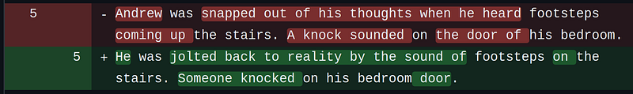
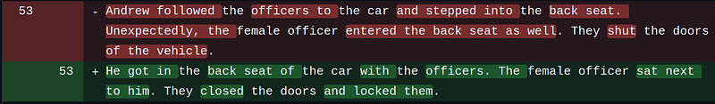
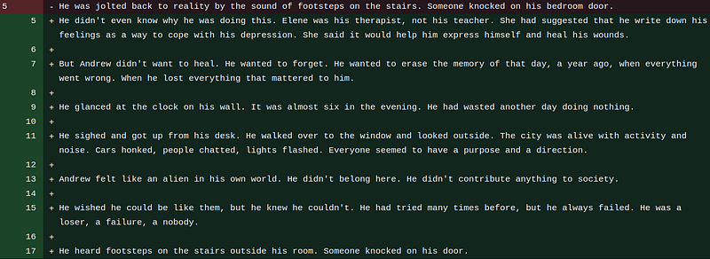

In April 2020 I started authoring a fiction novel. It took me about 1.5 years to get to a first draft. Another year of editing later, I was nearing a finished book. And then generative AI came around the corner to shatter my hopes and dreams.

And no, I’m not going to whine about generative AI ruining the careers of authors. I welcome the generative AIs with open arms, and I think they can be great tools if used properly.

The problem lies entirely with me. I’m a sucker for authority. And the generative AI, in my opinion, holds a lot of authority. It has a vast amount of knowledge, which I judge far superior to my knowledge. And by blindly trusting that knowledge, I completely ruined the novel that I’d spent 2.5 years writing.

You see, when I found out about the capabilities of GPT, I immediately tried to make it copy-edit my book. And it did a great job.

For example:

In red, we see my original writing. In green, we see the changes that GPT (in this case Bing AI) applied to it. In my opinion, GPT improved the text in every way.

In this one sentence, I saw how GPT could convert the monotone passages of my book into awesome-sounding sentences. So I let GPT copy-edit my entire book. Little did I know, that GPT was chipping away at the identity of my book bit by bit.

Let’s look at another example:

In this example, GPT decided to sneak in some little details, namely that both officers enter the back seat and that the doors of the car are locked. Both details may seem minor, but they are completely out of place in what I’m trying to convey with this passage. Also, many such small departures from the original story make the story quite different.

It gets even worse when we ask GPT to come up with entire passages. In this example, I was trying to improve the start of the first chapter of the book since I felt it was a bit dull. This is what Bing AI came up with:

Generally, not bad. But it’s hella verbose. And it’s a lot of exposition (breaks the “show, don’t tell” principle. For example:

But Andrew didn't want to heal. He wanted to forget. He wanted to erase the memory of that day, a year ago, when everything went wrong. When he lost everything that mattered to him.

and

He wished he could be like them, but he knew he couldn't. He had tried many times before, but he always failed. He was a loser, a failure, a nobody.

I hate these sentences with every fiber of my being. They sound kinda deep, but they say absolutely nothing. And I see GPT do that a lot. Generate verbose empty sentences that say very little.

To what extent I will end up using GPT in the writing of my novel, I’m not sure. But what I am sure of is that blindly trusting GPT is asking for disaster. Where at first I felt most of the edits improved my book, right now I feel it’s completely taking the original message of the text out of it.

So there you have it. AI-generated fiction sucks.

Power to the people 😛