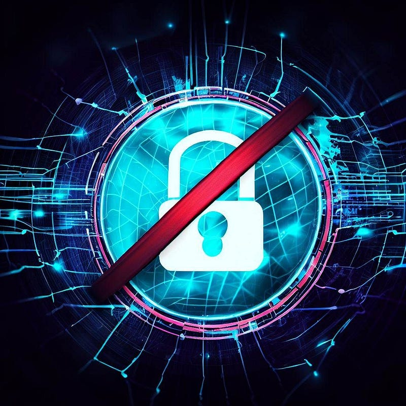
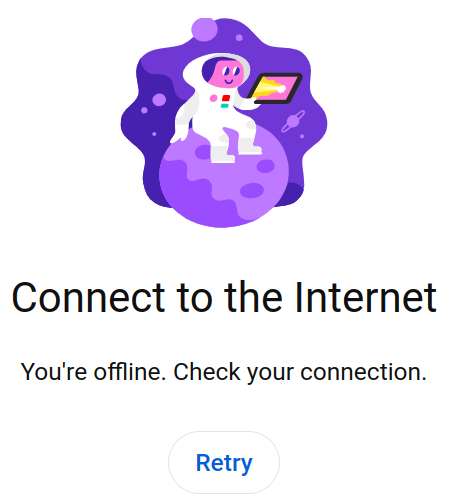
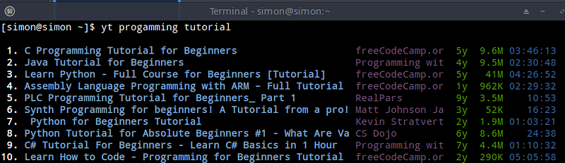
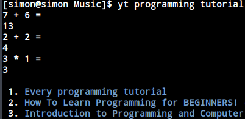
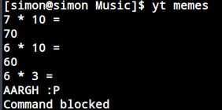

_“Hey, check out this cool YouTube video I saw the other day.”_

My friend grabs my keyboard and navigates to YouTube.com.

However, YouTube greets them with the following screen:

“_You can’t,_” I say.

“_What… why_?”

“_I blocked access to YouTube on my laptop._”

“_Can’t you just turn it off?_”

“_Not really,_” I say.

Technically, I can, but it would cost me at least several minutes of tinkering around the several safeguards that I put in place to keep myself from YouTube.

And YouTube is not the only website. Netflix, Reddit, Twitter, and the list goes on and on.

“_Why don’t you just exercise self-control?_”

I can’t. I’ve tried often enough. The thing is, I get obsessed about things easily. I can’t start a Netflix series without watching it all the way to the end, otherwise it will consume my thoughts till I resume. And furthermore, it’s better to not use self-control when it’s not necessary (put the cookie jar out of sight — Stanford Marshmallow Experiment).

Yeah, that’s quite extreme. And though not everyone is so extreme in that regard, many people find themselves distracted by digital tools every now and then.

The point I want to make through this article: **I think we should block ourselves from accessing any digital tool that does not serve us**.

YouTube is a great example for many people. YouTube has a lot of amazing entertaining and educational content. At first, we discover a lot of cool channels and learn new things. The tool serves us. But then, we build some muscle memory to open a new tab and navigate to YouTube, click the first recommended item, and watch someone satisfyingly cut a steel cube in half for the next twenty minutes. When the twenty minutes are over, autoplay redirects us to the next item, and down the rabbit hole we go. At this point, the tool no longer serves us. We serve the tool. And we created a habit around it.

**Blocking digital services is an excellent way to unlearn bad habits.**

For a while, I’ve used YouTube via the CLI using a tool called [youtube-viewer](https://github.com/trizen/youtube-viewer). No more clickbait thumbnails, no more recommended feed, no more autoplay. Only content that we specifically ask for:

But after a while, even that became a problem for me, because I started using it for mindless entertainment. However, YouTube is a service I do need sometimes. So, I made it a step harder for myself to access, so it’s not worth the effort for a quick dopamine rush, but it’s still available if I really need it. Now the command asks a couple math questions before giving access to the service:

Some of the other blocking tools I use:

*   I run a custom blocklist using [hblock](https://github.com/hectorm/hblock) (hard to bypass)
*   I use [Leechblock](https://chrome.google.com/webstore/detail/leechblock-ng/blaaajhemilngeeffpbfkdjjoefldkok) as a Chrome extension (easy to bypass)
*   I use a custom extension to remove “distracting features” from websites like StackOverflow, Bing, etc.
*   I use adblockers to get rid of distracting advertisements

In general, I think digital entertainment is one of the biggest pitfalls of the 21st century. And as such content becomes easier to produce (and thus more of it starts circulating), we need to shield ourselves from becoming consumed by it. Blocking tools are one method of setting up such a shield. Mental health and dopamine control are other factors, but that’s a story for another day.