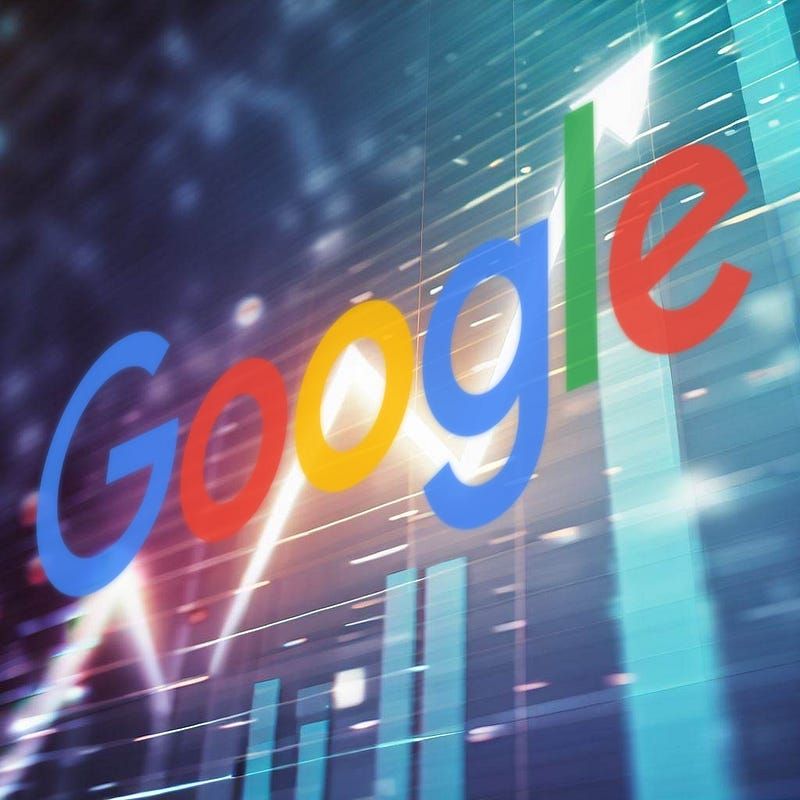

Generative AI has shaken up the tech industry. It has completely transformed many digital jobs, and its implications are still echoing throughout the world. But as with all new technologies, it takes time before the true impact is felt. And I think that Google will be responsible for the next AI era.

So far, most of the consumer AI products have been made by OpenAI and Microsoft (disregarding the open-source scene). Google released Bard, but it is far less usable and popular than its OpenAI counterparts. My own experimentation with Bard resulted in lots of [hallucination](https://en.wikipedia.org/wiki/Hallucination_%28artificial_intelligence), something that Bing hardly does anymore.

Some people have compared generative AI to a search engine: one that does not just pick the result from the available data, but is smart enough to combine data to give you exactly what you are looking for. For example, if I were to search Google Images for “a brown bear with a purple tuxedo”, it would be unable to give me exactly what I am looking for. I would see purple tuxedos and brown bears, but no images that combine both. Generative AI combines the two to give me exactly what I am looking for.

But generative AI in its current state is still quirky. Generated images do not always look very good and do not always directly reflect the prompt. Chat models still make lots of mistakes. And there are other generative AI areas that we have barely even explored yet: for example, generating video, music, games, software, etc.

When I think about the future of generative AI, I imagine the entire internet as a fully customized place. When I use a search engine, I imagine I get _exactly_ what I am looking for, even if it does not exist. When I go to YouTube, I imagine my video feed being filled with _exactly_ the videos that appeal to me. There would be no need anymore to watch boring content: everything I consume would be _exactly_ what appeals to me most.

To create a great AI, you mainly need two things: good data and a good validation/optimization method. By the latter, I mean that we should be able to test the performance of our AI model somehow, to score our models against other versions/variants of it.

And that’s where Google comes in.

Google has the most popular search engine and video platform. Those are two platforms generating massive amounts of data, but most importantly, they are also great platforms to _test_ iterations of an AI model.

Let’s take YouTube as an example. On YouTube, Google has been optimizing the platform to maximize ‘watch-minutes’: how can we keep people engaged for as long as possible? They use metrics to determine what video to play next so that you keep watching for as long as possible. But right now, Google can only pick from videos that creators make. If there is nothing out there that would keep you engaged, Google cannot recommend it.

But now, say we use those metrics as input for a generative AI model such that it optimizes for creating content that you will **love**. It is a difficult problem, so it takes time to train such a model properly and keep people actually engaged. But if there is one company that can pull it off, it’s Google. Google is the only company that has enough guinea pigs (you) to optimize a model so effective that we never want to do anything else ever again than watch YouTube.

…and then we stop making babies and mankind ceases to exist.

The End ;-)

**Side note:** This article focuses only on the consumer side of generative AI tools. On the business and developer side of the landscape, the reflections of this article may not fully reflect the reality of the market.