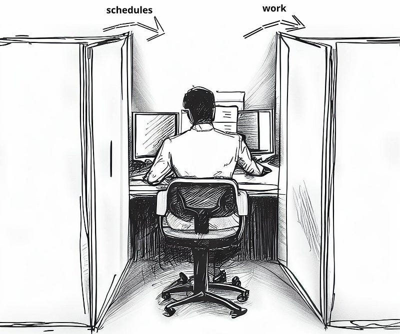

In 1944, at the height of the Second World War, the American Office of Strategic Services (OSS) issued a booklet called the “SIMPLE SABOTAGE FIELD MANUAL”. It lists things that civilians in enemy territory can do to disturb everyday work. Here are a couple of items [copied from that manual](https://en.wikisource.org/wiki/Simple_Sabotage_Field_Manual/Specific_Suggestions_for_Simple_Sabotage)\]:

*   Insist on doing everything through “channels.” Never permit short-cuts to be taken in order to expedite decisions.
*   Make “speeches.” Talk as frequently as possible and at great length. Illustrate your “points” by long anecdotes and accounts of personal experiences.
*   When possible, refer all matters to committees, for “further study and consideration.” Attempt to make the committees as large as possible — never less than five.
*   Bring up irrelevant issues as frequently as possible.
*   Haggle over precise wordings of communications, minutes, resolutions.
*   Advocate “caution.” Be “reasonable” and urge your fellow-conferees to be “reasonable” and avoid haste which might result in embarrassments or difficulties later on.
*   Be worried about the propriety of any decision — raise the question of whether such action as is contemplated lies within the jurisdiction of the group or whether it might conflict with the policy of some higher echelon.
*   Do everything possible to delay the delivery of orders. Even though parts of an order may be ready beforehand, don’t deliver it until it is completely ready.
*   To lower morale and with it, production, be pleasant to inefficient workers; give them undeserved promotions. Discriminate against efficient workers; complain unjustly about their work.
*   Multiply the procedures and clearances involved in issuing instructions, pay checks, and so on. See that three people have to approve everything where one would do.
*   Apply all regulations to the last letter.

Each of these items comes verbatim from the sabotage manual. But unfortunately, to many of us, they ring way too familiar. The modern-day office is filled with examples of these “acts of sabotage”! But what if we take each of those items and do **exactly the opposite**? And that’s why, today, I present to you: The Simple “Doing The Actual Work” Field Manual.

#### **Advocate Speed, Not Caution**

_“We care about quality over quantity.”_

I’ve heard that sentence quite often in software companies. Common practice is to have at least two people review any change to the source code. We were advocated to carefully review changes, nitpicking on even the smallest of impurities.

Only to later scrap the code altogether.

Personally, I think we should pick speed over quality every time.

We should strive to do everything as fast as possible. If we go fast, we can get far. If we go far, we can see all the problems down the road. We can focus on perfecting a feature’s functionality before we perfect its design. We can validate assumptions quickly.

Quality is something we build into the product once the current design becomes an issue. At that point, we can clearly see the present problems and work towards a future state where those problems are no longer present. It also creates the perfect opportunity for learning: we only learn if we face problems first-hand and go through the effort of fixing them, instead of safeguarding ourselves at every step from running into them.

Another advantage of advocating for speed is that it is simply more fun. And fun is important. Nobody likes to discuss for hours about the design of a simple piece of logic. Production go brrr.

#### **Simplicity Over Complexity Every Time**

Any big organization is complex. Just a single look at the org chart confirms it. Layers upon layers of management. And what do those managers do? They structure the work. They set deadlines, create schedules and plan meetings.

All of the above is complexity.

The fallacy underlying it all is that we think that if we don’t plan things, they won’t happen. You get an organization that becomes reactive: we input a schedule on the left and the worker produces output on the right. And that, my dear reader, is very inefficient.

Now, what we should do is turn that company culture 180 degrees around and create a company centered around autonomy. It might seem scary because it requires letting go of a certain degree of control. But you’d be surprised just how well people can organize themselves. No more managers, no more layers of organization, etcetera. All that is needed is responsibility.

In a flat organization, employees should take responsibility for the skills they were hired for, applied in the best interest of the company. Like that, an organization organically organizes itself without inefficiencies that slow down the process. To check out how that goes in practice, I can highly recommend the [book](https://www.bravenewwork.com/) and [podcast](https://www.bravenewwork.com/podcast) called Brave New Work by Aaron Dignan. It presents numerous accounts of self-organizing companies and lots of interesting stories about how to create a company culture that works.

#### **Be Transparent and Reward Performance/Competency**

Measuring employee performance is usually frowned upon. It invites unhealthy work habits and is prone to ‘gaming the system’. But I don’t think we have to meticulously track what people do to get an idea of the contribution they have to the organization. It all comes with setting your organization up in a transparent way.

For example, when it comes to leadership, two factors play a big role in whether someone is promoted to a leadership position:

*   How long have they been in the company?
*   How vocal are they?

Both of the above items are bad metrics to measure someone’s leadership ability. In my view, a good leader is someone I look up to and can learn from. And the only way they have that quality for the work I do is if they get their hands dirty and do the work I do. Position follows competence, not the other way around.

#### **Conclusion**

Let’s go over each of those “sabotage” items once more and write down what we should actually do.

**Sabotage:** Insist on doing everything through “channels.” Never permit short-cuts to be taken in order to expedite decisions.

**Solution:** Always directly communicate if possible. Make sure the information only lands with the people who really need it. Opt for a text message if possible.

**Sabotage:** Make “speeches.” Talk as frequently as possible and at great length. Illustrate your “points” by long anecdotes and accounts of personal experiences.

**Solution:** Instead of a speech: write it down and send it to people, then let them come to you with questions.

**Sabotage:** When possible, refer all matters to committees, for “further study and consideration.” Attempt to make the committees as large as possible — never less than five.

**Solution:** Any group, whatever the purpose, should never be bigger than four.

**Sabotage:** Bring up irrelevant issues as frequently as possible.

**Solution:** Only discuss big stuff, let people make small decisions individually and organically.

**Sabotage:** Haggle over precise wordings of communications, minutes, resolutions.

**Solution:** Write only what is absolutely necessary down. Otherwise, write personal notes but don’t require anyone to look at them.

**Sabotage:** Advocate “caution.” Be “reasonable” and urge your fellow-conferees to be “reasonable” and avoid haste which might result in embarrassments or difficulties later on.

**Solution:** Always opt for the fastest approach.

**Sabotage:** Be worried about the propriety of any decision — raise the question of whether such action as is contemplated lies within the jurisdiction of the group or whether it might conflict with the policy of some higher echelon.

**Solution:** Be as flat as possible. No power differentials.

**Sabotage:** Do everything possible to delay the delivery of orders. Even though parts of an order may be ready beforehand, don’t deliver it until it is completely ready.

**Solution:** Deliver information directly but asynchronously. Don’t demand quick responses.

**Sabotage:** To lower morale and with it, production, be pleasant to inefficient workers; give them undeserved promotions. Discriminate against efficient workers; complain unjustly about their work.

**Solution:** This is where we need transparency. Make it visible when someone is not pulling their weight.

**Sabotage:** Multiply the procedures and clearances involved in issuing instructions, paychecks, and so on. See that three people have to approve everything where one would do.

**Solution:** Committing directly to \`master\` is fine for small or risk-free changes (given competent engineers), otherwise assign the least possible number of reviewers. Use reviews mainly as a knowledge-sharing tool; when it stops serving that purpose, stop reviewing.

**Sabotage:** Apply all regulations to the last letter.

**Solution:** Rules are there to be broken 🙃