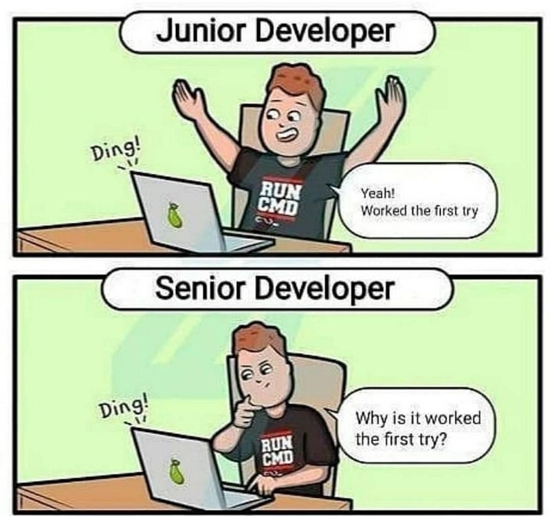

Imagine you’re maintaining a blog website. One day, you receive a message from a user stating that they find your blog hard to read because of the site’s background, and they ask if you can add an option to turn it off. Being a good samaritan, you comply with their request. You put on your power glove and start coding (all coders do that, right?).

Three hours of coding later, you finish your “user settings” page. The solution is… actually quite convoluted. Before this request, it was just a static site. Now you suddenly need state management. So, you decide to add a state management library. You also didn’t really have visual components for the form, so a design framework flew in. And to persist the user settings, you had to create a persistence layer that writes the settings to local storage.

But your user is happy :)

Years go by. Every now and then, you get a notification for a library update. In year two, the state management library releases a new major version, and you need to re-implement the state management code to fit the new API. In year three, the UI of the user settings page feels outdated, so you migrate to a new framework. In year four, you decide to migrate the website to React, which requires re-engineering most of the code surrounding user settings as well.

Then, one day while grocery shopping, you run into the user who originally asked for the feature! Enthusiastically, you ask them how the user settings work for them.

_“What user settings?”_

_“You know, the one on my blog.”_

_“Ah sorry, I haven’t really used it.”_

Your life flashes before your eyes. All that effort. All the time investments. For nothing.

#### **Make all code pay rent**

Architecting software has a surprising number of similarities to architecting buildings. And like a suburb, rent has to be paid to make it a sustainable investment. When an old dusty house no longer garners any tenants, it might be time to tear it down or schedule a big renovation. Or maybe the house is still good, but the city loses its popularity, and thus nobody wants to live in the neighborhood anymore.

With software, there’s a similar situation. Each software component, each document, each test — they take up real estate in our minds. Each follow-up change requires careful consideration of all those moving parts. But it’s not just the bigger parts of the software. A single complex function can already cause more issues than it solves (pareto rule).

Not only the code garners complexity over time. It’s also the process. If you’ve worked on any larger software product, you will notice that the amount of talking about the software increases with each software iteration. As the software expands, the process expands with it, and decisions start to become more complicated to make.

When complexity is not paying its rent, it will save time/money/effort to evict it at earliest convenience. We don’t need no squatters ‘round here.

#### **Developer PTSD**

Software complexity is the main cause of what I like to call _Developer PTSD_.

You are not a true developer until you have:

*   Pulled an all-nighter chasing after a particularly pesky bug
*   Banged your head against the wall when you found the solution
*   Refactored the entire codebase a minimum of ten times
*   Abandoned several side-projects because they became unmanageable
*   Considered becoming a farmer and enjoying the rural life

Any experienced developer has some form of PTSD that triggers them to code in a specific way. If I look at my code ten years ago versus now, I notice I do the following things:

*   I used to love `try-catch-print` around checked exceptions. Now I love `try-catch-throw` around every friggin’ statement.
*   I avoid pulling in libraries/frameworks like the plague (they incur huge learning and maintenance efforts).
*   I consider extremely unlikely edge cases and handle them gracefully.
*   If something doesn’t have direct user value, I don’t do it. I value simplicity over everything else.
*   I push back vigorously on my client’s wishes. I refuse to code things of which I don’t see the value.
*   When refactoring, I love deleting code that hasn’t paid its rent.

#### **You are the user of your own life**

Let’s depart from the software for a second, and take a philosophical look at complexity in our own lives.

We live in an attention economy. An increasingly large number of things beg for our attention. Each of those things makes our life more complicated. And, just like our software, our lives become increasingly unmanageable the more complicated they become.

_Let’s consider all our possessions, hobbies, ventures, commitments, obligations, etc. Are they paying their rent in (anticipated) user value?_

I used to love playing video games. Searching for interesting games, hunting for easter eggs, reading game news, and all related things took up a lot of mental space. Sadly, I lost interest over time. The games are not paying their rent anymore. So they’ll have to go.

#### **Conclusion**

Time is our most precious resource. How efficiently we can use our time is wholly dependent on our physical and mental capabilities. But there’s a killer on the loose. The killer’s name is complexity, and its target is your mental space.

Make sure that time is spent on the important things. In the early stages of a software project, that means creating the smallest set of features that are of direct value to the customer. In later stages, it may mean simplifying or re-designing existing features to increase their user value or adapt them to an ever-changing environment.

Don’t be like this guy. Don’t beg for your rent. Features must pay their rent or GTFO.

**Side note:** Loosely inspired by [Making Beliefs Pay Rent (in Anticipated Experiences](https://www.lesswrong.com/posts/a7n8GdKiAZRX86T5A/making-beliefs-pay-rent-in-anticipated-experiences)).