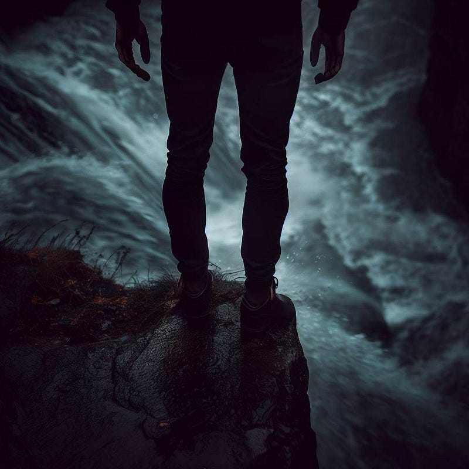

To bring all my writings into one place, I decided to add this fictional story I once wrote to my Medium blog. If you’re here for short snappy articles about real-world things, skip this one :)

**Synopsis**: After his accidental death, Ben finds himself faced with a foreign entity. The entity presents him with a dilemma that will seal his fate.

**Trigger warnings**: Explicit use of language. The story revolves around topics like death and suicide.

A strong breeze blew across the Nordic coasts, in perfect unison with the water that crashed against the rocks below. Ben was dancing on a cliff, in a comfortable daze that was fuelled by the liquor he’d downed a few hours earlier. He neared its edge. A rush of adrenaline surged through his body as he heard water splashing violently against the rocks far below. He kicked at a few loose rocks, watching them tumble all the way down.

But then, the ground started shifting beneath Ben’s feet, as he noticed the pile of loose stones he’d stepped on. A strong gush of wind blew relentlessly against his body, pushing him closer to the cliff’s edge. He fought against the sense of vertigo. It was to no avail, as the claws of gravity snatched him from the cliff, yanking him down with a force he didn’t know existed.

At a moment of certain death, people sometimes say they gain a strange sense of clarity and see their lives flashing by. For Ben, there was no conscious experience at all. There was only a crushing surge of adrenaline and a complete takeover of primal instincts, frantically searching for a lifeline. It was in vain. All surroundings flashed by, and he hit the rocky shores with a massive blow. There was a sharp pain beyond imagining, but it only lasted a split second. Then, at once, all experience ceased to be. No sight. No smell. No sound. Nothing.

Yet, in this seeming sea of nothingness, there was still something. Something that should have blinked out with the rest of his senses. Consciousness. Even though the physical body was now probably beyond recognition, as it had splattered against the rocks, the experience of standing there on the rocks still stuck. The mind, which shouldn’t be functioning anymore, seemed very much intact.

Ben’s mind was racing, as it rapidly tried to find a narrative that could explain his situation. Had someone been able to revive him, and was this how it felt to be in a coma? The mind still active, yet all other senses gone? It seemed impossible, as the cliff had been way too high to allow for any medical intervention. But then, what was processing his thoughts? What was holding his memories?

_“Ben…”_

Someone said his name. Yet, there was no voice or sound associated with the message. The message had just… appeared. All senses were still down, yet something was trying to interact with him.

“What the fuck?” Ben tried to say, but naturally, no words and no sound emerged.

_“You’ve reached the end, only to meet a new beginning…”_

Ben grew frustrated at how foreign everything seemed. There was a voice, trying to contact him, yet the voice had no features at all. There wasn’t even a gender associated with the voice. There were only words floating around in his mind, if there even was a mind in the first place.

“WHO THE FUCK ARE YOU?!” Ben tried to yell into the nothingness, but there was again no mouth that spoke the words, and no sound filling the omnipresent nothingness.

_“Please, stay calm. We can take everything at your pace. To answer your question, I’m the one who will ease you into your new reality.”_

“YOU ARE FREAKING ME OUT!” Ben yelled, or thought, or whatever. His mind was starting to go into overdrive at this point. After falling off a cliff and meeting certain death, the senseless nothingness that consumed him now was too absurd. Combined with a lack of physical experience, the whole event was terrifying. Normally, if a stranger’d confront him, there was always the option to fight or flee. However, in the present moment, there was no such escape.

_“I’m only here to help…”_

Ben didn’t respond this time. He had to collect his thoughts, instead of aimlessly screaming into nothingness. He tried to recall all the events that brought him here. He’d been hiking in Norway, all by himself, to calm down after heightened tensions between him and Emma, who was now his ex-wife. A momentary lapse of judgment was all it took for the trip to reach a sudden end.

He could hardly even recall the fall itself anymore, yet the momentary flash of pain still resounded in his being. And after that, his senses vanished, yet consciousness seemed to remain. However, he was not alone. There was a voice, yet not a voice, addressing him. He, she, or it, even knew his name.

Going over the events helped ease his mind. And the only way to really make sense of the situation seemed to be through the entity that was within him.

“Please, explain to me, where am I?” Ben projected the words mentally, as he’d done before to address the entity. It felt rather unnatural to speak this way, as was the lack of sensory experience he was subjected to.

_“I’m afraid I cannot answer that question. Right now, you are neither connected to space nor time.”_

If the entity was going to continue speaking in riddles like that, Ben would have a complete mental breakdown in no time.

“Then how can we be communicating?” asked Ben, trying to keep his cool. Cursing would bring him nowhere.

_“Conscious beings, like yourself, inhibit a wealth of information. When your shell fails, we create a copy of what defines you, and connect it to me to find you a new purpose.”_

“So, I am really dead?” asked Ben incredulously.

_“Yes… You are.”_

Ben had never been religious and had always envisioned death as an absolute end, after which there was nothing. Scientifically, that was the only explanation that made sense, since to his understanding a human being was merely a conjunction of physical, chemical, and neurological processes. Just like there is nothing before birth, there shouldn’t be anything after death. Yet here he was.

“So, what are you?” asked Ben.

_“I’m afraid that’s beyond your level of comprehension. The closest I could get to explaining that, is by describing myself as a severely limited mental projection. My main purpose is to help you find your new self.”_

Ben was rather fed up with the cryptic language this entity inhibited. Even though the entity didn’t seem to be of harmful intention, it kept freaking him out that it spoke through his mind. Regardless of all the connections he’d had in his former life, his mind had always been his. Now, those boundaries didn’t even seem established anymore.

“So, what are we doing here?” asked Ben.

_“We’re going to find out what your new purpose is going to be. We’ll talk about the life you lived, your virtues, and your sins, and we’ll find you a new place.”_

That sounded very much like the religious stories he’d heard sporadically during his time on Earth. Weighing virtues and sins, like some kind of god?! And the entity had even spoken about finding him a new place, like a decision between heaven and hell. It couldn’t be. It just couldn’t fucking be.

“Wait, you’re some kind of god?” asked Ben.

_“In some sense, yes, I am. Yet, I have no control over what happens on Earth or in any other place for that matter. I am merely governing streams of consciousness and memory, as they arise and cease to be.”_

A wave of sudden anger welled up inside Ben. He was fed up with the barrage of vague words he was subjected to. Why couldn’t the entity for once make it clear what it meant?

“Well, fuck you,” said Ben. Mentally, that was. He hadn’t even been planning to say that. However, driven by sheer frustration, he just couldn’t resist telling the entity exactly how he felt about its cryptic demeanor.

_“As I said, we will take it at your pace. Curse all you want, I can’t be offended. I have only one purpose, all else is irrelevant to me.”_

The fact that the entity didn’t seem to have any emotions made things worse. Yet, Ben’s emotional spectrum still seemed very much intact. He felt like smashing windows, screaming out loud, and punching as hard as he could against the entity that was tormenting him. Yet, without physicality, his desires seemed to be out of reach.

Just as ferociously as the anger came, it subsided. It was pointless. All that mattered right now was to deal with his current situation. And that meant he had to go through the stupid setup the entity had created for him.

“Okay then,” said Ben. “How do we proceed?”

“Let’s take a look at your former life, your virtues and your sins, and use it to plan your afterlife.”

Ben was severely taken aback by this statement. The thing about ‘virtues and sins’ didn’t make any sense. What was even considered a ‘sin’? Weren’t those just human constructs? Each time Ben had done something forbidden by law, was that considered a sin here? Weren’t laws just made-up rules? How could that have any significance here?

_“Ben, calm down, I’m just mapping your former life. From my side, there is no judgment regarding the things you did.”_

“Are you reading my fucking mind?!” Ben said, getting infuriated again. First, the fucking entity trespassed on private property. Now, it was even accessing the information within.

_“I know all about you, Ben. I’m only here to help you.”_

“If you know all about me, why even bother asking me questions?” Ben asked. If he had a voice, he was sure there would be spite in his tone.

_“Usually the known domain is a good place to start before delving into the unknown.”_

“You probably already know, since you can read my mind and all, but I’m fed up with your cryptic shit,” said Ben. “Just tell me what’s up next.”

_“What’s up next is all up to you. However, it is up to me to show you the possibilities. When you spend a long time on Earth, your mind gets accustomed to the limitations that the Earth has. Concepts that relate to humanity, like oxygen, gravity, and mass, are not universal constants in the bigger picture.”_

“So, you’re saying that what my afterlife is going to be, is up to me?” asked Ben.

_“Well, at the end of our conversation, I’m going to offer you a choice. A red and a blue pill, so to speak. You can choose the red pill, which means your consciousness ceases to be, a true death. Or you take the blue pill, which grants you eternal life.”_

Hearing those words, Ben felt quite excited. Apparently, life wasn’t over at all.

“So, when I choose the blue pill, will I be placed back on earth?” asked Ben.

_“No, your life on Earth is over. If you choose eternal life, you will have a free choice over your desired situation, free from all the limitations of being a human on earth. You could become anyone or anything.”_

“So instead of getting back on earth, I can create a place of my own?” asked Ben. “I could create the nicest beach, drinking cocktails until eternity?” he added jokingly.

_“See, that’s why your current knowledge is not sufficient to make this decision. That’s why I need to govern this process. The idea you are proposing now is subject to the human sense of limitations. But, right now your former shell is gone. Everything that made you human, except for how your mind is organized, is no longer relevant.”_

“So you’re saying I could also choose a new ‘shell’, as you call it?” Ben asked. “As in, I could become an animal?”

_“You’re still thinking of earthly concepts. Now take a step further, and let go of all such limitations.”_

“Uhhmm, you kinda lost me there,” said Ben. “I do want my senses back… I guess I could become a stronger and healthier being, but I’d still want to hear, feel, see, and smell. Even though that’s probably what you’d call ‘human limitations’.”

_“If we take such senses to a more abstract level, they are just input accessible to your brain. Right now, your only input is your communication with me, which allows you to comprehend my words, even though I’m not speaking in a language at all. Likewise are the actions you perform in the world just the output of your being. Regarding such input and output, the options are limitless.”_

“Yet, as you said, I still inhabit my very much human brain and thoughts,” said Ben. “Even though the options are limitless, there’s only so much complexity my brain will be able to comprehend. Unless that’s also a flexible component in this proposition.”

_“Very wise, Ben. Usually, minds I connect with choose for eternal bliss at this point, in one form or another. Yet the limitation you mention, which you are indeed still subject to, changes the proposition.”_

Ben’s mind spun as he tried to absorb all this new information. Meanwhile, he was also occupied by the difficult decision ahead, which was something he could never make a fully informed decision about. The red pill would leave him to die for real, never experiencing anything anymore. The blue pill gave him a choice over his next situation, which he’d be living for eternity. There was also a third option, which was not to consume a pill at all. He could delay his decision for any period, as time didn’t play a role here.

So that’s what he did: he thought. Mentally, he constructed entire universes he could live in, millions of beings he could be, and different senses he could have. The longer he thought, the more distant his former life grew. Sight, noise, and warmth were all relics of a distant past. But however much he longed to have those senses back, nothing he could think of seemed worth being experienced eternally. But he also didn’t want to die.

Then, a thought struck him. An idea that could extend his life, without committing to any specific afterlife.

“I would like to be placed back on an exact copy of Earth, in Norway, where I was before my fall,” said Ben. “I want to be an exact copy of my human body, and all rules that apply to Earth should apply to my copy as well. After death, I will be connected to an exact copy of the entity you represent, allowing me to decide again over my desired situation. Except it wouldn’t be able to grant true death, of course.”

_“Very wise. So you will live on, yet you don’t want to place limitations on the universe you create.”_

“Exactly,” said Ben. “And, most importantly, I will finish my human life with my former senses, even with the knowledge of what happens after death. I want to live an eternity, but I need to be careful with my mental state. A descent into insanity is not pleasant when lived for an eternity. If I’m in this for the long run, I need to take my time and plan further ahead. So instead of giving myself superpowers or anything, I will trap myself on earth until my day finally comes.”

_“Then so it will be.”_

As the last words were spoken by the entity, everything started to shift around Ben. At once, all his senses returned. After not being able to see for so long, the world around him seemed extremely pure and crisp. Watching over the cliffs at the sea beyond was truly a breathtaking sight.

However, in the transition to his all-new world, Ben also noticed something else. The former lucidity of his disembodied self had faded, replaced by an alcohol-induced haziness. The contrast made him doubt his decision. Would he really be able to stay sane, or would he ultimately fall back to the destructive behaviors that had gotten him killed in the first place?

As the sun began to set and the shore grew dark, Ben trudged back to his cottage. All the while, his mind was spiraling further into desperation, fuelled by his drunken state of mind. His life hadn’t been great before the fall. Had he made a mistake by condemning himself to this reality?

As he entered his cottage roughly an hour later, he immediately crashed down onto his bed. He was extremely exhausted. He lay surrounded by empty liquor bottles and other artifacts of bad decisions he’d made. They sparked memories of a time that seemed long ago. He remembered how much he craved to have Emma back with him.

Maybe, just maybe, he could make it happen.

All it took was a simple leap of faith…