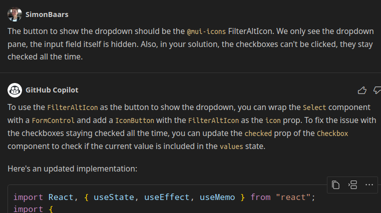

I learned Java by decompiling the Minecraft source code and making changes to it. The code I wrote was ugly and functional. It didn’t take long before I had a codebase so convoluted that it became impossible to change it. Then I went to university. I learned about the ancient techniques of design patterns and refactoring, to make code that’s actually _readable_.

However, since then, many things have changed. LLMs have taken over the world. Computers can now read and understand code. But what does that mean for us, plain old programmers? Have our ancient honed skills really lost their value?

**My answer:** yes they have, and unless we become LLM masters, we will soon become irrelevant.

**My new skill:** I can type triple backticks (` ``` `) faster than ever before. Basically, whenever I get to a point in coding where an LLM could do a subtask, I hit `CTRL+A`, `CTRL+C`. I move the cursor over to the **GitHub Copilot Chat** chat-window, and type ` ``` `, `SHIFT+ENTER`, `CTRL+V`, ` ``` `, `SHIFT+ENTER`, `SHIFT+ENTER`. That key combo is etched in my soul. After typing it, I describe what I want, and when I finish I hit `CTRL+A`, `CTRL+C`, `ENTER`.

The LLM responds with something like `Sure, here's an updated implementation that [what I asked it to do]:`. Next, many lines of code scroll by, waiting for which to complete has become my new meditation. When it finishes, copy, paste, and check the git diff. 

Does the git diff seem sensible? Then I test the functionality. 

Does it totally not work as intended? Then I tweak the original prompt to bias the LLM to a better solution.

Complicated? Let’s try a little example.

For a project I’m involved in, I built a custom table component using React and Material UI. Well, really I just asked the LLM to make a table and later asked it to extract it to a custom component. An extra requirement from the client was to have the ability to filter the table contents. So I went to my custom table component, pressed `CTRL+A` (select all), `CTRL+C` (copy) and opened a new GitHub Copilot Chat window.

Then, in the window I typed:

This is my custom React \`@mui\` table component:  
\`\`\`  
\[ENTIRE CODE FILE PASTED HERE\]  
\`\`\`  
  
If for a \`column\`, the \`filter\` property is set to \`checkboxes\`,  
enable an \`@mui\` filter icon behind the header name, that when clicked,  
shows a dropdown with checkboxes for each value in the column,  
and when any checkbox is clicked, it filters the column on that value  
(or those values if multiple are clicked).

Easy prompt, but a feature that required a whole lot of code changes. And at my command, the LLM spit out a whole bunch of code:


I checked the diff, and noticed that the LLM had taken an odd approach by including an entire dropdown in the column header. I tested the solution, but it had many defects. With follow-up prompts, I tried to remedy the solution:



Unfortunately, the solution was similarly broken. I went back to my initial prompt, and made slight changes to the wording, to prompt for the specific icon that I wanted and add some notes on what I do and do not want to see:

This is my custom React \`@mui\` table component:  
\`\`\`  
\[ENTIRE CODE FILE PASTED HERE\]  
\`\`\`  
  
If for a column, the filter property is set to checkboxes,  
enable an @mui filter icon behind the header name, that when clicked,  
shows a dropdown with checkboxes for each value in the column,  
and when any checkbox is clicked, it filters the column on that value  
(or those values if multiple are clicked).  
The button to show the dropdown should be the @mui-icons FilterAltIcon  
(in white).  
We only see the dropdown pane, the input field itself is hidden.  
Make it such that all checkboxes are unchecked by default  
(which means everything is shown),  
and items can be clicked to apply the filters.

Again, the LLM gave a solution. The solution had an interesting approach: instead of using an ordinary dropdown, it recreated the dropdown using `@mui` Paper. The solution looked better as well. But ultimately, the functionality worked very poorly and had many bugs.

Having learned a couple of things about the right solution direction, I killed the chat session once more (to clear the chat context), and tried my final golden prompt:

This is my custom React \`@mui\` table component:  
\`\`\`  
\[ENTIRE CODE FILE PASTED HERE\]  
\`\`\`  
  
If for a column, the filter property is set to checkboxes,  
enable an @mui filter IconButton behind the column name, that when clicked,  
shows a dropdown (located directly under the IconButton) with checkboxes for  
each value in the column, and when any checkbox is clicked,  
it filters the column on that value (or those values if multiple are clicked).  
The dropdown is shown only after clicking the IconButton,  
and is dismissed when we click elsewhere  
(ClickAwayListener can be used for that).  
The button to show the dropdown should be the @mui-icons FilterAltIcon  
(in white).  
Make it such that all checkboxes are unchecked by default  
(which means everything is shown),  
and items can be clicked to apply the filters.

Note that in this prompt I ask for very specific details of which I know that they should be included to get the right solution (using the FilterAltIcon, having a ClickAwayListener, etc).

Trying this final prompt, I finally got properly functional code that yields a beautiful table filter feature:


A little bit of custom tweaking later, and the feature worked completely as intended. Now, all this back and forth with the LLM did take quite a bit of time. But it is worth it, because:

*   The LLM handles edge cases such as empty input, invalid input, null pointer exceptions, etc. that would otherwise require manual coding and testing.
*   When it actually works, LLM code is usually relatively bug-free (it saves quite some human error).
*   The LLM doesn’t care much about code quality, and even sometimes refactors when there is a need (or we specifically prompt for it), which is a lot of time saved (no more time spent tweaking the code design).
*   LLMs are the future, and as these things get more sophisticated, there’s less room for human programming.

Programming means writing computer instructions. Every first year CS student struggles to understand how a computer thinks, because the computer doesn’t know how humans think. So humans writing code is just silly. Instead, we should hone the skill that we know best: natural language. The machine can do the rest :)